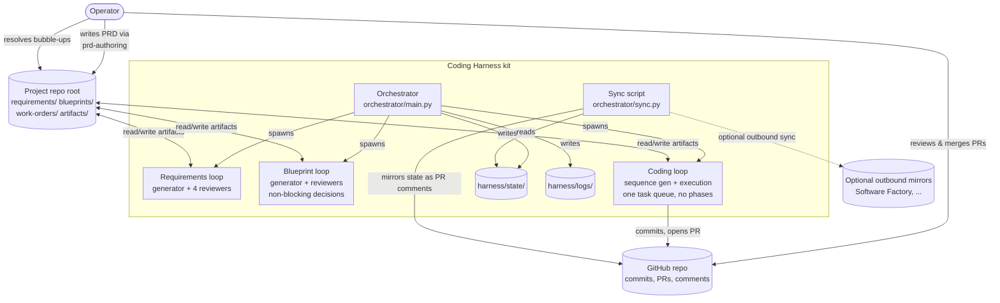
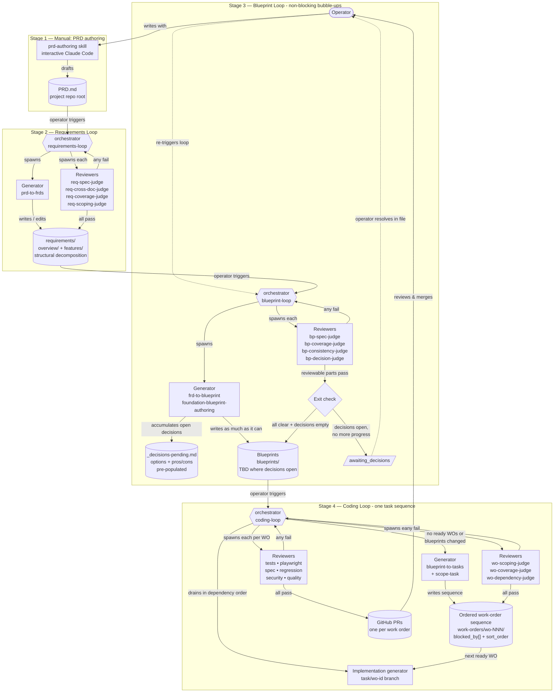

---
cssclasses:
  - wide-mermaid
---

# Coding Harness — Working Blueprint

> **Temporary working document.** Captures the implementation architecture for the harness kit so the PRD can stay at the product level. When the blueprint loop ships (v0.2), this gets refactored into the proper `blueprints/` tree with `.blueprint.meta.yaml` etc. Until then, this is the authoritative source for *how* the harness works. `PRD.md` is the source for *what* it does and *why*.

## 0. System architecture

### 0.1 Component map



### 0.2 Project lifecycle

All four stages, end to end. Stage 1 is manual; Stages 2–4 are orchestrator-driven autonomous loops. Reviewer-fail arrows are shorthand for "orchestrator re-spawns the generator with aggregated review context" — the orchestrator owns the retry decision, not the generator. See §1 for the full sequence.



## 1. Loop mechanic

The orchestrator drives every autonomous loop. One `claude -p` subprocess per agent invocation. No agent-to-agent spawns within a loop — generators and reviewers never call each other directly.

### 1.1 Sequence per attempt

For each attempt of a loop, the orchestrator:

1. **Spawns the generator.** Builds a prompt containing:
   - The generator's skill (e.g. `prd-to-frds`).
   - Current on-disk state of every artifact tree the generator reads or writes (for requirements loop: `PRD.md` + existing `requirements/` tree; for blueprint loop: `requirements/features/` + existing `blueprints/` + `_decisions-pending.md`; etc.).
   - On retry attempts: prior attempt's generator summary + every reviewer's JSON verdict + accumulated push-back notes (§2.3).
   - Attempt counter and remaining budget.
   Spawns `claude -p "<prompt>"`. Wall-clock cap enforced per subprocess.

2. **Generator works and exits.** Reads inputs, writes or edits artifact files on disk, emits a stdout summary describing what it did and what it chose not to do (including any push-back on prior reviews), exits. Generator does not commit to git — the orchestrator owns commits.

3. **Spawns each reviewer** as a separate `claude -p` subprocess. Each reviewer's prompt contains:
   - The reviewer's skill (e.g. `req-coverage-judge`).
   - The generator's stdout summary from step 2.
   - Only the artifacts that reviewer needs to judge its rubric (e.g. coverage-judge gets `PRD.md` + the requirements tree; spec-judge gets only the FRDs it's checking).
   - Output path for its JSON verdict.
   Reviewers can run serially or in parallel — v0.1 runs them serially for simplicity.

4. **Reviewers write verdicts** to a stable scratch path, `harness/state/reviews/<reviewer-name>.json` (format in §7.3). The reviewer skill only needs to know this one path; it doesn't know the current attempt number. Stdout is for logging; the JSON file is the contract.

5. **Orchestrator aggregates.** Reads every reviewer JSON for this attempt. Three outcomes:
   - **All pass** → commit artifact tree changes to git with a descriptive message (`requirements-loop: attempt 2 passed`), write a final state entry, exit 0.
   - **Any fail and attempt < cap** → assemble retry context (all JSONs + prior summary + current on-disk state), spawn generator again (attempt N+1).
   - **Any fail and attempt ≥ cap** → write `exhausted` verdict, leave files on disk uncommitted, exit 1 for operator inspection.

Blueprint loop has a fourth outcome (§1.5).

### 1.2 Between-attempt git discipline

Within a single orchestrator invocation, attempts do not commit. The generator writes to disk; on fail, files remain as working-tree changes; the next attempt's generator sees them. The orchestrator commits only when a loop reaches `pass` (or on the non-failure `awaiting_*` exits — see §1.5). This keeps git history clean (one commit per loop run, not one per attempt) and makes mid-run state inspection trivial (just `git diff`).

Exception: per-work-order execution in the coding loop commits as part of its PR flow. That's the existing per-WO model.

### 1.3 Reviewer output JSON format

Every reviewer writes this shape to `harness/state/reviews/<reviewer-name>.json` (a stable scratch path the reviewer knows). Before spawning the reviewer, the orchestrator removes any prior file at that path; after the reviewer exits, the orchestrator reads the JSON and archives it to `harness/state/reviews/<loop>/[<task-id>/]attempt-<N>/<reviewer-name>.json` for audit. The reviewer never sees or names the attempt directory.

```json
{
  "reviewer": "req-coverage-judge",
  "loop": "requirements",
  "attempt": 2,
  "ran_at": "2026-04-22T10:15:00Z",
  "verdict": "fail",
  "summary": "PRD §3 describes three personas but no requirements/overview/personas/ node exists.",
  "findings": [
    {
      "severity": "critical",
      "category": "MISSING",
      "location": "requirements/overview/",
      "description": "PRD §3 enumerates three personas in detail; the tree has no personas/ overview node.",
      "suggestion": "Create requirements/overview/personas/ with the three personas from PRD §3."
    }
  ]
}
```

Rules:
- `verdict`: `pass | fail | not_run`.
- `category`: one of the review rubric values — `CONFLICT`, `MISSING`, `AMBIGUOUS`, `DUPLICATION`, `STALE`, or rubric-specific values (e.g. `COVERAGE`, `SCOPING`, `STRUCTURE`).
- `severity`: `critical | minor`. Only `critical` counts toward `fail`.
- `findings` is empty when `verdict: pass`.
- `location` is a path relative to the project repo root or a logical reference (e.g. `requirements/features/auth.md`, `blueprints/_decisions-pending.md`).
- `suggestion` is what the reviewer would do — the generator may accept, modify, or push back against it.

### 1.4 Retry context assembly

When the orchestrator spawns the generator for attempt N+1, the retry-context prompt block contains:

```
# Retry context — attempt N+1 of M (M = max_attempts)

## Prior attempt's summary
<verbatim generator stdout from attempt N>

## Reviewer verdicts (attempt N)
- <reviewer-name>: <verdict> — <summary>
- ...

## Reviewer findings (attempt N)
<inlined contents of every reviewer JSON with verdict=fail>

## Prior push-back notes (all prior attempts)
<accumulated push-backs from prior summaries — see §2.3>

## Current working tree state
<orchestrator-generated listing: which files changed since base, which are new>
```

This is not a state file the agent edits — it's just input to its next run. The generator responds by writing a new summary that addresses each finding (fix, justify, or gap-file).

### 1.5 Non-failure "awaiting operator input" exits

Two of the upstream loops can exit in a non-failure, non-pass state when they have produced as much as they can but need operator input to continue. Both are treated identically by the orchestrator: commit artifact progress, write a loop-state entry, print a summary of what's open, exit with code 2 (distinct from pass=0 and fail=1). Subsequent runs continue from the updated state once the operator has resolved the pending items.

**Requirements loop — `awaiting_clarification`**
- Trigger: `PRD.md` has ambiguities, contradictions, or undefined references the generator flagged.
- Operator input file: `requirements/_questions-pending.md`. Append-only during the loop.
- Block format:
  ```markdown
  ## <short question title>

  **Where in PRD:** <section heading, or short verbatim quote>
  **What's ambiguous:** <one paragraph>
  **What would unblock:** <what the operator needs to add/clarify in PRD.md>

  ---
  ```
- How the operator resolves: edits `PRD.md` to clarify, deletes the question block (or renames the file to `_questions-resolved-<timestamp>.md` for git audit), re-runs the loop.
- No "options" field — the answer is "clarify the PRD", not "pick from a menu".
- Full `pass` requires all four reviewers pass AND `_questions-pending.md` has no open questions.

**Blueprint loop — `awaiting_decisions`**
- Trigger: the generator hit a decision requiring operator judgment (tech stack, major architecture, auth provider, etc.).
- Operator input file: `blueprints/_decisions-pending.md`. Append-only during the loop.
- Block format: title, context, 2–4 pre-researched options with pros/cons, recommended default, blank `Your choice:` field.
- How the operator resolves: fills in `Your choice:` lines, deletes resolved blocks (or renames the file to `_decisions-resolved-<timestamp>.md`), re-runs.
- Full `pass` requires all four reviewers pass AND `_decisions-pending.md` has zero unanswered decisions.

**Coding loop has no equivalent** — work-order execution either passes, fails, or exhausts. If the operator has input to provide, they provide it by editing blueprints or work-order descriptions directly before re-running.

**Do not confuse push-back with bubble-up:** push-back is the generator disagreeing with a *reviewer* about the current attempt's output (§2.3); bubble-up (questions, decisions) is the generator asking the *operator* for input that isn't in the source artifacts. Different mechanisms, different audiences, different files.

See §5.3 in the PRD for the product-level description. The generator recognises decisions it can't make and appends to the decisions doc (§2.3 push-back is related but not the same — see clarification there).

### 1.6 Retry cap

Default: `max_attempts = 3` per loop invocation. Configurable in `config.yaml`. When reached without passing, orchestrator writes `verdict: exhausted` and exits.

Wall-clock cap is a separate, per-subprocess budget: if a generator or reviewer subprocess exceeds `max_wall_minutes`, it's killed and the attempt is marked as `exhausted` regardless of attempt count.

## 2. Generator identity and discipline

Each generator runs as a senior professional for its stage — not a tool. The role framing lives in the skill file and the generator's prompt includes it every invocation.

### 2.1 Role per loop

| Loop | Identity | Owns |
|---|---|---|
| Requirements | Lead product manager | Decomposition fidelity to the PRD; feature scoping; structural shape of the requirements tree. |
| Blueprint | Lead engineer | Technical soundness; blueprint-to-FRD coverage; cross-blueprint contracts; decision hygiene. |
| Coding — sequence generation | Lead tech lead | Work-order atomicity; dependency-graph correctness; coverage of blueprint surface. |
| Coding — per-WO execution | Individual contributor | The commit that fulfils one work order's acceptance criteria. |

The identity matters because reviewers will push back, and a tool says "yes boss" while a senior professional decides when a push-back is grounded and when it isn't.

### 2.2 Priority anchors

Reviewers check for violations of these; the generator defends against them. Any reviewer finding that doesn't serve one of these priorities is a candidate for push-back.

- **Coverage** — every element in the source artifact maps to something in the output tree. Missing-by-design (operator omitted a topic) is explicitly allowed.
- **Grounding** — nothing in the output exceeds what the source supports. Zero fabrication.
- **Scoping** — each unit is atomic per its layer's definition (feature-unit for FRDs, work-order unit for work orders).
- **Structure** — every output follows the canonical shape for its type.

### 2.3 Push-back discipline

When reviewer feedback arrives on a retry:

1. **Read every finding.** Don't batch-reject or batch-accept.
2. **For each finding**, choose one of three responses:
   - **Fix.** The finding names a real violation of a priority anchor. Edit the tree accordingly.
   - **Push back.** The finding asks for content that would violate grounding (would require fabrication), or enforces the wrong priority, or is misguided. Don't change the tree. In the generator's stdout summary, document the disagreement: *which* finding, *why* it's wrong, *what* the grounded alternative is.
   - **Surface to the operator.** The finding points at a real problem that's out of scope for this loop (e.g. the PRD itself is ambiguous and the operator needs to clarify). Use the loop's bubble-up mechanism — log a question for the requirements loop, log a decision for the blueprint loop. Reference the finding in your summary, move on.
3. **Summarise.** The generator's stdout summary ends with a per-finding disposition list: "Addressed findings F1, F3. Pushed back on F2 (reason: would require fabricating personas). Filed gap for F4."

Push-backs accumulate across attempts into the retry context so the generator doesn't forget prior reasoning. If a reviewer flags the same finding three attempts in a row and the generator pushes back each time with the same reason, the loop exhausts — operator inspects the standoff.

**Push-back ≠ bubble-up.** Push-back is the generator disagreeing with a *reviewer* about the current attempt's output. Bubble-up is the generator asking the *operator* for input that isn't in the source artifacts — PRD clarification in the requirements loop (`_questions-pending.md`), architectural decisions in the blueprint loop (`_decisions-pending.md`). Different mechanisms, different audiences, different files.

## 3. Python orchestrator

`orchestrator/main.py`. Entry point via `python -m orchestrator <subcommand>` or `make <subcommand>`.

### 3.1 Subcommands

- `requirements-loop` — drives Stage 2 (PRD §5.2).
- `blueprint-loop` — drives Stage 3 (PRD §5.3).
- `coding-loop` — drives Stage 4 (PRD §5.4). Sub-flags: `--one` (run one work order), `--gen-only` (stop after sequence generation).
- `status` — prints current loop state across all three loops, open decisions, ready-work-order count, uncommitted changes in artifact trees.

Operator runs one subcommand at a time. Loops are not daemons.

### 3.2 Shared orchestrator flow (loop driver)

All three loop subcommands share this driver (`orchestrator/loop_driver.py`):

```
load_config()
state = load_or_init_loop_state(loop_name)
for attempt in range(1, max_attempts + 1):
    gen_prompt = build_generator_prompt(loop_name, attempt, state)
    gen_result = spawn_claude(gen_prompt, wall_clock_cap)
    state.record_generator_output(attempt, gen_result.stdout)

    if gen_result.verdict in ("awaiting_decisions", "awaiting_clarification"):
        commit_artifacts(f"{loop_name}: attempt {attempt} — {gen_result.verdict}")
        print_open_operator_items()
        exit(2)

    review_results = []
    for reviewer in loop_reviewers(loop_name):
        rev_prompt = build_reviewer_prompt(loop_name, reviewer, attempt, state)
        rev_result = spawn_claude(rev_prompt, wall_clock_cap)
        verdict_json = read_verdict_json(loop_name, reviewer, attempt)
        review_results.append(verdict_json)
    state.record_reviewer_verdicts(attempt, review_results)

    if all_pass(review_results):
        commit_artifacts(f"{loop_name}: attempt {attempt} passed")
        exit(0)

    # else: continue to next attempt

# hit cap
state.finalise("exhausted")
exit(1)
```

Per-loop specializations supply: prompt builders, reviewer list, the artifact trees to read/commit, and any post-hooks.

### 3.3 Per-loop specialisations

**`requirements-loop`.**
- Precondition: `PRD.md` exists at repo root. If not, exit with error.
- Artifact trees: generator writes visible `<slug>.md` content files flat inside `requirements/overview/` and `requirements/features/`. If a node has children, generator creates a sibling `<slug>_children/` directory with the same flat shape recursively. May also append to `requirements/_questions-pending.md`.
- **Post-generator meta materialisation.** After the generator exits and before spawning reviewers, walk the `requirements/` tree and reconcile dotted-hidden meta files. For each directory in the tree:
  - For every visible `<slug>.md` content file, ensure two dotted-hidden sibling meta files exist:
    - `.<slug>.<kind>.meta.yaml` (`<kind>` is `overview` or `feature` depending on which subtree the file is in), with fields `id: null`, `parent_id: null`, `position: <discovery order among siblings>`, `title: <first H1 in the content file>`.
    - `.<slug>.requirements.meta.yaml` with `id: null`.
  - For every dotted-hidden meta file whose `<slug>.md` counterpart was deleted, remove the meta file.
  - After cleanup, if a `<slug>_children/` directory is empty (its parent node lost all children), delete it.
  - Preserve existing meta files whose fields hold non-null values (an SF mirror sync may have populated IDs; don't clobber).
- Reviewers: `req-spec-judge`, `req-cross-doc-judge`, `req-coverage-judge`, `req-scoping-judge`. They see the fully-materialised tree.
- Generator prompt inputs: `PRD.md` + current `requirements/` tree + current `_questions-pending.md` (if any) + retry context.
- Pass condition: all reviewers pass AND `_questions-pending.md` has zero open questions. Otherwise `awaiting_clarification`.

**`blueprint-loop`.**
- Precondition: `requirements/features/` non-empty.
- Artifact trees: writes `blueprints/` (including `_decisions-pending.md` appends).
- Reviewers: `bp-spec-judge`, `bp-coverage-judge`, `bp-consistency-judge`, `bp-decision-judge`.
- Pass condition: all reviewers pass AND `_decisions-pending.md` has zero unanswered decisions. Otherwise `awaiting_decisions`.
- Generator prompt inputs: `requirements/features/` + current `blueprints/` + current `_decisions-pending.md` + retry context.

**`coding-loop`.** Two-part flow:
1. **Sequence generation** (runs when no ready work orders OR blueprints hash changed since the last `work-orders/.sequence.meta.yaml`):
   - Artifact trees: writes `work-orders/wo-NNN/`.
   - Reviewers: `wo-scoping-judge`, `wo-coverage-judge`, `wo-dependency-judge`.
   - On pass: update `.sequence.meta.yaml` with current blueprints hash, continue to drain.
2. **Per-work-order execution drain** (existing per-WO model):
   - Detect any `in_progress` work orders whose PR was merged since last run; transition to `done`.
   - `planner.get_next_ready()` respecting `blocked_by[]` + `sort_order`. None → exit 0.
   - Move work order to `in_progress`, initialise `harness/state/<task_id>.json`, set `execution.branch = task/<task_id>`.
   - Spawn `coding-generator` (writes code on the task branch, opens PR, self-commits); the six execution reviewers run via the same gen→review→retry driver as upstream loops but the generator commits and pushes rather than the orchestrator.
   - After subprocess exit: populate `execution.pr_*` via `gh pr list --head task/<task_id>`; rotate state; post the PR comment.
   - By default, drain. `--one` runs a single work order.

### 3.4 Scope constraints

- **No direct LLM calls.** All model interactions via `claude -p`.
- **Orchestrator writes only inside `harness/` and triggers `git commit` for artifact trees.** Generators write artifact files; orchestrator commits them.
- **Everything else is permitted:** subprocess management, prompt construction, stdout capture, state-file rotation, `gh`/`git` queries, PR comment posting, status transitions, decisions-file detection.

Target: ≤ 800 lines of Python across orchestrator + planner + git_ops + state + mirrors. The three loop subcommands share ~80% of their code via `loop_driver.py`.

## 4. Local planner

`orchestrator/planner.py`. Reads and writes the on-disk layout. Single concrete class — no Protocol — because there is only one queue.

```python
Status = Literal["backlog", "ready", "in_progress", "done"]

class WorkOrder(TypedDict):
    task_id: str                  # "wo-NNN", zero-padded
    title: str
    description_markdown: str     # full description.md contents
    status: Status
    priority: str | None
    type: str | None              # BUILD | FIX | REQUIREMENTS | BLUEPRINT | ARTIFACT | OTHER
    parent_id: str | None
    sort_order: str               # lexicographic, stable ordering
    blocked_by: list[str]
    blueprint_ids: list[str]
    path: Path                    # absolute path to the work-order directory

class LocalPlanner:
    def __init__(self, project_root: Path = Path.cwd()): ...
    def get_next_ready(self) -> WorkOrder | None: ...
    def get(self, task_id: str) -> WorkOrder: ...
    def update_status(self, task_id: str, status: Status) -> None: ...
    def get_ordered_ready(self) -> list[WorkOrder]: ...
```

Status updates write through to `.work-order.meta.yaml`. Orchestrator is the only writer. Git history is the audit trail — no separate event log.

## 5. Mirrors

Optional one-way outbound adapters. Local is authoritative; mirrors are convenience.

### 5.1 Protocol

```python
class Mirror(Protocol):
    """Outbound sync. Reads local state; writes to an external system."""
    def push_status(self, work_order: WorkOrder) -> None: ...
    def push_comment(self, work_order: WorkOrder, body: str) -> None: ...
```

### 5.2 Planned mirrors

- `software_factory.py` — pushes work-order status and comments to SF once its upload API ships. Already structurally compatible because local layout mirrors SF's entity model.
- `github_projects.py` — optional read-mostly mirror surfacing a kanban view on GitHub. Deferred.

### 5.3 Constraints

- One-way only (push). Inbound sync deferred, may never be built.
- Failures are logged but never block orchestrator progress.
- Failures don't roll back local state. Next successful push reconciles.

### 5.4 Config

`config.yaml` at project repo root. Mirrors are explicit opt-in.

```yaml
# project repo root is implicit (CWD when orchestrator runs).

max_attempts: 3
max_wall_minutes: 120

mirrors:                           # empty list = local-only (v0.1 default)
  - kind: software_factory
    base_url: https://sf.internal
    project_id: 0f1e2d3c-4b5a-6978-8765-432101234567
```

## 6. Code surface

`orchestrator/git_ops.py`. Wraps `gh` and `git`. Responsibilities: branch creation, commits, PR open, PR comment post, merge detection, working-tree status.

Not abstracted; not a "backend". The local planner doesn't know about PRs, and the git layer doesn't know about work-order metadata. The orchestrator stitches them together.

## 7. State file schema

### 7.1 Two shapes, same plumbing

- **Per-work-order state** at `harness/state/<task_id>.json`. Used by the coding loop's per-WO execution.
- **Per-loop state** at `harness/state/<loop-name>.json` (one each for `requirements-loop`, `blueprint-loop`, `coding-loop-seq-gen`). Used by the non-per-task flows.

Both share top-level fields (`current`, `history`, `attempts`, `verification`, `limits`); per-task files additionally carry `local.*` and `execution.*`.

The entire `harness/` directory is **committed to git** — first-class project artifact, not runtime scratch. Powers audit, replay, failure-mode analysis, future training data. Log files are the only entries that may be pruned; state files are never deleted.

### 7.2 Per-work-order state (example)

```json
{
  "task_id": "wo-042",
  "local": {
    "title": "Add login endpoint",
    "path": "work-orders/wo-042/",
    "blueprint_ids": ["bp-uuid-1"]
  },
  "created_at": "2026-04-18T10:00:00Z",
  "updated_at": "2026-04-18T10:45:12Z",
  "status": "in_progress",
  "attempt_count": 3,

  "limits": {
    "max_wall_minutes": 120,
    "max_attempts": 5
  },

  "execution": {
    "branch": "task/wo-042",
    "pr_url": "https://github.com/owner/repo/pull/123",
    "pr_number": 123
  },

  "current": {
    "last_output": "Attempt 3 summary: addressed findings F1/F3/F5; pushed back on F2..."
  },

  "verification": {
    "tests":            { "result": "pass", "ran_at": "..." },
    "playwright":       { "result": "pass", "ran_at": "..." },
    "spec_judge":       { "result": "pass", "ran_at": "..." },
    "regression_judge": { "result": "pass", "ran_at": "..." },
    "security_judge":   { "result": "pass", "ran_at": "..." },
    "quality_judge":    { "result": "pass", "ran_at": "..." }
  },

  "attempts": [
    { "n": 1, "at": "...", "verdict": "fail", "summary": "...", "review_dir": "harness/state/reviews/coding/wo-042/attempt-1/" },
    { "n": 2, "at": "...", "verdict": "fail", "summary": "...", "review_dir": "harness/state/reviews/coding/wo-042/attempt-2/" },
    { "n": 3, "at": "...", "verdict": "pass", "summary": "...", "review_dir": "harness/state/reviews/coding/wo-042/attempt-3/" }
  ],

  "history": [
    { "session": 1, "at": "...", "final_verdict": "pass", "output": "(final attempt's summary)" }
  ],

  "mirror": {
    "last_posted_session": 1,
    "last_mirrored_at": "..."
  }
}
```

### 7.3 Per-loop state (example)

```json
{
  "loop": {
    "name": "blueprint",
    "artifact_paths": ["blueprints/"]
  },
  "created_at": "2026-04-19T09:00:00Z",
  "updated_at": "2026-04-19T09:32:00Z",
  "status": "awaiting_decisions",
  "attempt_count": 2,
  "limits": { "max_wall_minutes": 60, "max_attempts": 3 },

  "current": {
    "last_output": "Produced 4 feature blueprints and 2 foundation blueprints..."
  },

  "verification": {
    "bp_spec_judge":        { "result": "pass", "ran_at": "..." },
    "bp_coverage_judge":    { "result": "pass", "ran_at": "..." },
    "bp_consistency_judge": { "result": "pass", "ran_at": "..." },
    "bp_decision_judge":    { "result": "pass", "ran_at": "..." }
  },

  "open_decisions": 3,

  "attempts": [
    { "n": 1, "at": "...", "verdict": "awaiting_decisions", "open_decisions": 5, "summary": "...", "review_dir": "harness/state/reviews/blueprint/attempt-1/" },
    { "n": 2, "at": "...", "verdict": "awaiting_decisions", "open_decisions": 3, "summary": "...", "review_dir": "harness/state/reviews/blueprint/attempt-2/" }
  ],

  "history": [
    { "session": 1, "at": "...", "final_verdict": "awaiting_decisions", "output": "..." },
    { "session": 2, "at": "...", "final_verdict": "awaiting_decisions", "output": "..." }
  ]
}
```

### 7.4 Reviewer verdict JSON

See §1.3. Reviewer writes to `harness/state/reviews/<reviewer-name>.json`; orchestrator archives to `harness/state/reviews/<loop>/[<task-id>/]attempt-<N>/<reviewer-name>.json` after reading. For per-loop reviews, `<task-id>` is omitted from the archive path.

### 7.5 Field rules

- `task_id` — `wo-NNN` zero-padded. Stable forever.
- `local.*` — denormalised snapshot of the work order's meta, refreshed on every orchestrator read. Canonical source is `.work-order.meta.yaml`.
- `status` — canonical enum: `backlog | ready | in_progress | done`. Mirrors `.work-order.meta.yaml`. Loop-level state adds `awaiting_decisions` (blueprint), `awaiting_clarification` (requirements), and `exhausted` (any loop).
- `attempt_count` — number of attempts this session. Increments each time the orchestrator re-spawns the generator within one invocation.
- `limits` — per-subprocess wall-clock cap, per-invocation attempt cap. Both configurable.
- `current.last_output` — verbatim stdout of the most recent generator session this invocation.
- `attempts[]` — append-only log of attempts within a single invocation. Cleared to `[]` at the start of each new orchestrator invocation (history keeps the final per-invocation summary).
- `verification.<gate>` — populated by the orchestrator from reviewer JSONs. `pass | fail | not_run`.
- `history[]` — append-only across orchestrator invocations. One entry per invocation, preserving the final summary.
- `execution.branch` — set by orchestrator before spawning. `execution.pr_url` / `pr_number` populated post-exit via `gh pr list`.
- `open_decisions` — blueprint loop only. Zero is required for `pass`.
- `mirror.last_posted_session` — tracks which history entries have been mirrored as PR comments.
- All timestamps ISO 8601 UTC.
- Schema version implicit in harness version; breaking changes need a documented migration.

### 7.6 Write access

- **Orchestrator is the only writer.**
- Per invocation: orchestrator loops through attempts, each attempt spawning a generator and every reviewer, rotating `current` → `attempts[]`, and on exit rolling `attempts[]`'s final entry into `history[]`.
- Reviewer JSONs are written by reviewer subprocesses directly — the orchestrator just reads them.
- Per-reviewer and per-attempt outputs are preserved on disk (not in the state file) so audit and replay can reconstruct an invocation fully.

## 8. Verdict format

### 8.1 Generator output

Generator ends its stdout summary with a `VERDICT:` line that the orchestrator parses.

- **Upstream loops** (requirements, blueprint, sequence generation): generator emits `VERDICT: ready_for_review` on a normal attempt. It does *not* aggregate reviewer verdicts — the orchestrator does that from the JSONs.
- **Requirements loop alternative exit**: `VERDICT: awaiting_clarification` with `open_questions: N` and `questions_file: requirements/_questions-pending.md`.
- **Blueprint loop alternative exit**: `VERDICT: awaiting_decisions` with `open_decisions: N` and `decisions_file: blueprints/_decisions-pending.md`.
- **Per-WO coding execution**: generator self-reports `VERDICT: ready_for_review` after opening/updating the PR; the orchestrator then spawns the six coding reviewers.

This is simpler than the prior model because the generator never aggregates cross-reviewer state.

### 8.2 Reviewer output

Primary contract is the JSON file (§1.3). Reviewer stdout is free-form logging for operator debugging.

### 8.3 Orchestrator aggregation

Orchestrator reads every reviewer JSON for the attempt, computes `all_pass = all(v["verdict"] == "pass" for v in verdicts)`, and decides whether to retry, pass, or exhaust. All `verification.*` fields in state files are populated from the JSONs, not from the generator's summary.

## 9. Hooks

Configured in `.claude/settings.json`. Log to `harness/logs/<task_id-or-loop-name>/hooks.log`.

Hooks do only what must happen inside the Claude Code session — context the orchestrator can't provide from outside. State management is in the orchestrator.

- **`Stop` (generator)** — validates the stdout summary ends with a recognised `VERDICT:` line. Blocks completion if missing.
- **`Stop` (reviewer)** — validates that the expected reviewer JSON file was written at the expected path. Blocks completion if missing.

Not hooks (and why):
- Context injection at session start — orchestrator builds the full prompt and passes it as the argument to `claude -p`. No `SessionStart` hook.
- State rotation, attempt increment — orchestrator, post-exit.
- PR comment mirroring — orchestrator.
- `SessionEnd` — nothing for hooks to do.

## 10. Agents

Under `.claude/agents/`. Role-specialised prompts. The agent definition references its skills.

### 10.1 Generator agents (orchestrator-spawned)

Each carries its own autonomy posture (no clarifying questions, decide and proceed) baked into its skill prompt.

- `requirements-generator` — loads `prd-to-frds`. Identity: lead PM. Writes `requirements/` tree; may append to `requirements/_questions-pending.md` for PRD ambiguities. Emits `ready_for_review` or `awaiting_clarification`.
- `blueprint-generator` — loads `frd-to-blueprint` + `foundation-blueprint-authoring` + `bubble-up-decision`. Identity: lead engineer. Writes `blueprints/`. Emits `ready_for_review` or `awaiting_decisions`.
- `wo-sequence-generator` — loads `blueprint-to-tasks` + `scope-task`. Identity: lead tech lead. Writes `work-orders/wo-NNN/`.
- `coding-generator` — loads `open-task-pr` + coding-specific capabilities. Identity: IC. Writes code on the task branch, opens/updates PR, commits as part of its flow.

### 10.2 Reviewer subagents (orchestrator-spawned)

Each writes its verdict JSON to the path the orchestrator supplies in the prompt.

- Requirements: `req-spec-judge`, `req-cross-doc-judge`, `req-coverage-judge`, `req-scoping-judge`.
- Blueprint: `bp-spec-judge`, `bp-coverage-judge`, `bp-consistency-judge`, `bp-decision-judge`.
- Coding sequence generation: `wo-scoping-judge`, `wo-coverage-judge`, `wo-dependency-judge`.
- Coding execution: `tests-runner`, `playwright-runner`, `spec-judge`, `regression-judge`, `security-judge`, `quality-judge`.

### 10.3 Utility

- `index-updater` — regenerates `harness/index.md` from planner state. Invoked on a schedule or after status transitions.

## 11. Open architecture questions

Tracked separately from PRD §8 (which tracks product/scope questions).

- **Parallel reviewer fan-out.** v0.1 spawns reviewers serially. Parallel is plausible (`claude -p` subprocesses are independent) but adds complexity (concurrent log files, race in verdict-file writes is unlikely but worth considering). Defer until serial is slow in practice.
- **Between-attempt commits.** v0.1 commits only on final pass. If a multi-attempt run is long and the operator wants to inspect intermediate state in git, they can by checking out a different branch — but v0.1 won't provide it. Revisit if needed.
- **Retry cap per reviewer vs global.** Current design: single cap per invocation (any reviewer failing counts). Alternative: a reviewer that fails the same finding three times is "stuck" and its finding becomes authoritative (generator must fix or gap-file). Possibly cleaner but more state to track. Defer.
- **Reviewer prompt size.** On large trees, feeding a reviewer every artifact it needs plus the generator summary plus the rubric can push context limits. Mitigations: scoped reviewer prompts (only files the reviewer has to read), file-by-file fan-out for per-file rubrics. Worry about it when we hit the limit.
- **Push-back persistence across invocations.** Within an invocation, push-backs carry in `attempts[]`. Across invocations, they're in `history[]` summaries. Not structured. If push-back reasoning becomes load-bearing, extract to a `push_backs[]` structured field.
