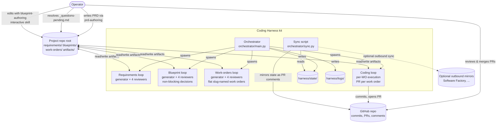
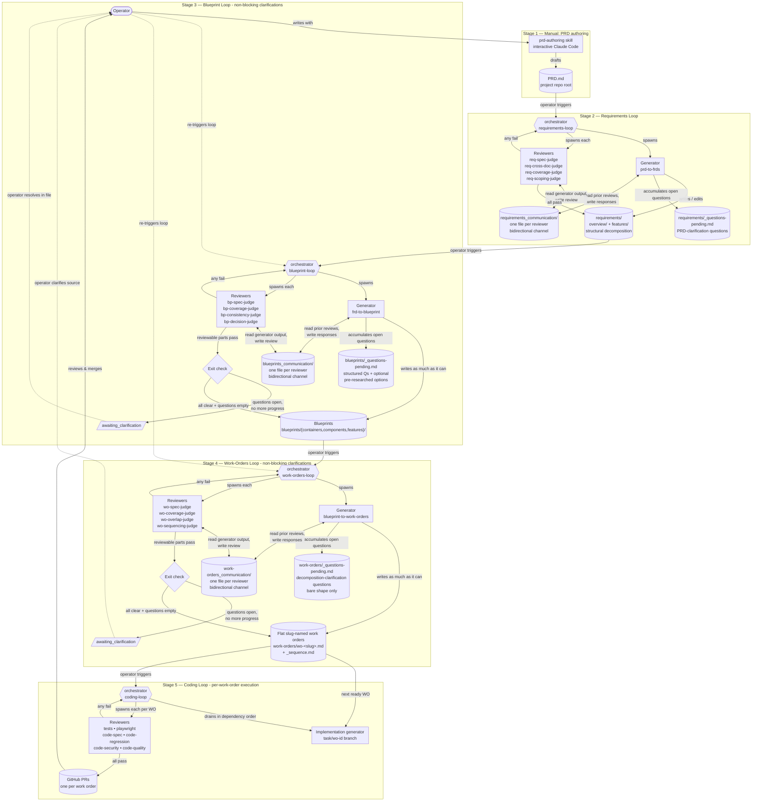

---
cssclasses:
  - wide-mermaid
---

# Coding Harness — Working Blueprint

> **Temporary working document.** Captures the implementation architecture for the harness kit so the PRD can stay at the product level. Once the blueprint loop is built and run against this kit, this doc gets refactored into the proper `blueprints/` tree. Until then, this is the authoritative source for *how* the harness works. `PRD.md` is the source for *what* it does and *why*.

## 0. System architecture

### 0.1 Component map



### 0.2 Project lifecycle

All five stages, end to end. Stage 1 is manual; Stages 2–5 are orchestrator-driven autonomous loops. Reviewer-fail arrows are shorthand for "orchestrator re-spawns the generator, which reads its inbox in the loop's `<loop>_communication/` folder for prior reviews and writes back its responses there" — the orchestrator owns the retry decision and the spawn order, not the message content. See §1 for the full sequence and §1.8 for the communication channel.



## 1. Loop mechanic

The orchestrator drives every autonomous loop. One `claude -p` subprocess per agent invocation. No agent-to-agent spawns within a loop — generators and reviewers never call each other directly.

### 1.1 Sequence per attempt

For each attempt of a loop, the orchestrator:

1. **Spawns the generator.** Builds a prompt containing:
   - The generator's skill (e.g. `prd-to-frds`).
   - Current on-disk state of every artifact tree the generator reads or writes (for requirements loop: `PRD.md` + existing `requirements/` tree; for blueprint loop: `requirements/features/` + existing `blueprints/` + `blueprints/_questions-pending.md`; etc.).
   - On retry attempts: a pointer to the loop's communication folder (`requirements_communication/`, `blueprints_communication/`, or `work-orders_communication/`) — the generator reads each reviewer's file directly to see prior reviews and its own prior responses (§1.8).
   - Attempt counter and remaining budget.
   Spawns `claude -p "<prompt>"`. Wall-clock cap enforced per subprocess. By default attempt 1 spawns a fresh session via `--session-id <uuid>` and attempts 2+ resume that session via `--resume <uuid>` with a short follow-up message — the agent retains its own reasoning across attempts. Pass `--memoryless` to force every attempt to spawn a fresh session and rely on the communication folder alone (§1.10).

2. **Generator works and exits.** Reads inputs (including prior-attempt content from the communication files), writes or edits artifact files on disk, writes its responses (proposals, push-backs, change-summary) into each reviewer's communication file, emits a stdout summary, exits. Generator does not commit to git — the orchestrator owns commits.

3. **Spawns every reviewer concurrently** as separate `claude -p` subprocesses (one `ThreadPoolExecutor` job per reviewer). Reviewers run with `--disallowedTools Bash,NotebookEdit`; `Write` and `Edit` are allowed but a `PreToolUse` hook (§9) blocks any path other than the reviewer's own communication file. Denylist (not allowlist) so future Claude Code tool additions don't silently break the harness — we only care about blocking the artifact-mutation surface. Each reviewer's prompt contains:
   - The reviewer's skill (e.g. `req-coverage-judge`).
   - The path to the reviewer's communication file (e.g. `requirements_communication/req-coverage-judge.md`) — the reviewer reads it for the generator's current proposal and prior conversation, then appends its review to the same file.
   - Only the artifacts that reviewer needs to judge its rubric (e.g. coverage-judge gets `PRD.md` + the requirements tree; spec-judge gets only the FRDs it's checking).
   Parallel fan-out is safe: each reviewer writes only to its own communication file (single-writer-per-file invariant), captures its own stdout, and reads the artifact tree read-only. No shared mutable state.

4. **Reviewers output reviews to their communication file plus a stdout verdict line.** The reviewer appends its full review to its `<reviewer-name>.md` file under the loop's communication folder. The reviewer's final chat message (captured as subprocess stdout) is a short acknowledgement ending with the `VERDICT: pass` or `VERDICT: fail` line — that's the only thing the orchestrator parses. The communication file is the durable channel; stdout carries only the verdict signal.

5. **Orchestrator aggregates.** Greps the trailing `VERDICT:` line from every reviewer's captured stdout for this attempt. The reviewer's `Stop` hook (§9) blocks completion in-session until the trailer is well-formed, so a parseable verdict is the expected case. The hook self-caps at `max_agent_retries` blocks per subprocess (§1.6) so it can't loop forever on a stubbornly-malformed model. If a reviewer's stdout still does not end with `VERDICT: pass` or `VERDICT: fail` despite the hook (hook cap reached, hook bypass, subprocess crash, truncated output), the orchestrator's **post-exit protocol-retry** kicks in (REQ-ORCH-013, see also §1.6): the orchestrator re-spawns the same reviewer in a fresh `claude -p` subprocess with a corrective prompt naming the malformed trailer, up to 2 protocol-retries per reviewer per attempt; if all retries also emit malformed verdicts, the orchestrator records `fail` for aggregation, appends to `protocol_failures[]` in the loop state, and continues. The full review content already lives in each reviewer's communication file — no archival step needed at this point. Three outcomes:
   - **All pass** → snapshot communication files into `harness/state/reviews/<loop>/[<task-id>/]attempt-<N>/<reviewer-name>.md` for audit (§7.4), leave the live communication folder in place (it's never wiped — §1.8), commit artifact tree changes to git with a descriptive message (`requirements-loop: attempt 2 passed`) when a git repo is present, write a final state entry, exit 0.
   - **Any fail and attempt < cap** → snapshot communication files into the per-attempt audit dir (so each attempt's transcript is preserved), spawn the generator again (attempt N+1) — the generator reads the live communication files for context, no orchestrator-assembled retry block needed.
   - **Any fail and attempt ≥ cap** → snapshot the final attempt, write `exhausted` verdict, leave files on disk uncommitted, exit 1 for operator inspection.

Both upstream loops have a fourth outcome (§1.5).

### 1.2 Between-attempt git discipline

Within a single orchestrator invocation, attempts do not commit. The generator writes to disk; on fail, files remain as working-tree changes; the next attempt's generator sees them. The orchestrator commits only when a loop reaches `pass` (or on the non-failure `awaiting_*` exits — see §1.5). This keeps git history clean (one commit per loop run, not one per attempt) and makes mid-run state inspection trivial (just `git diff`).

Exception: per-work-order execution in the coding loop commits as part of its PR flow. That's the existing per-WO model.

### 1.3 Reviewer output format

Every reviewer reads its communication file (§1.8), runs its review, **appends** the review to that same file, and exits. The reviewer's stdout is a short acknowledgement ending with `VERDICT: pass` or `VERDICT: fail` — that's the only thing the orchestrator parses for loop control. The full review content lives in the communication file, which is the durable bidirectional channel between this reviewer and the generator across attempts.

Shape of the appended review block (enforced by the reviewer skill; see `skills/requirements/req-*-judge.md`):

- A header line tagging the attempt number, e.g. `## Review — attempt 2`.
- One or two sentences summarising what the reviewer found.
- One short section per critical issue. Each section names the file path(s), states what's wrong in one or two sentences, gives the fix in one sentence, and tags a rubric category (`CONFLICT`, `MISSING`, `AMBIGUOUS`, `DUPLICATION`, `STALE`, or rubric-specific values like `COVERAGE`, `SCOPING`, `STRUCTURE`, `PARENT_CHILD`, `FABRICATED`, `BROKEN_REF`).
- A single final line in the appended block, on its own, containing exactly `VERDICT: pass` or `VERDICT: fail`. The same `VERDICT:` line is also the last line of the reviewer's stdout, so the orchestrator can grep stdout without reading the file.

Rules:
- The orchestrator parses only the final `VERDICT:` line of stdout for loop control. The communication file is the conversation transcript — generator and reviewer both read and write it; the orchestrator does not parse it for control flow.
- Reviewers append, never overwrite. The communication file accumulates the full back-and-forth across attempts so both sides can see the conversation history.
- Only critical issues appear in the body. Minor nits are noise.
- Paths are relative to the project repo root.
- No JSON, no schema. Markdown-only.

### 1.4 Retry context — read from the communication folder

Under the previous design the orchestrator assembled a retry-context prompt block that inlined every prior review and push-back note. With the communication-folder design (§1.8), that block is gone — the generator reads each `<loop>_communication/<reviewer-name>.md` file directly and finds the full conversation transcript already on disk.

What the orchestrator passes to the generator on retry:

```
# Retry — attempt N+1 of M (M = max_attempts)

The communication folder for this loop is at: <requirements_communication/ | blueprints_communication/ | work-orders_communication/>
Each reviewer's full review history (and your responses) is in <reviewer-name>.md inside that folder.

Read every reviewer file before deciding what to change. Append your responses (per-finding disposition + change-summary) to the SAME files you read from. Do not overwrite prior content; append at the end.

## Failing reviewers this attempt
<list of reviewer names whose VERDICT was fail on attempt N>

## Current working tree state
<orchestrator-generated listing: which files changed since base, which are new>
```

Failing-reviewer names are listed so the generator knows which files it must respond to; passing reviewers are deliberately omitted from this list — see §1.7 for why. Their files still exist and the generator can read them, but the prompt does not foreground them. The generator responds by editing artifacts on disk **and** appending its responses (per-finding disposition + change-summary per §1.7) to each failing reviewer's communication file.

### 1.5 Non-failure "awaiting operator input" exits

All three upstream loops can exit in a non-failure, non-pass state when they have produced as much as they can but need operator input to continue. **One mechanism across all three loops:** an append-only `_questions-pending.md` file in the loop's artifact tree, and a single `awaiting_clarification` exit verdict. The orchestrator handles all three the same way: commit artifact progress, write a loop-state entry, print a summary of what's open, exit with code 2 (distinct from pass=0 and fail=1). Subsequent runs continue from the updated state once the operator has resolved the pending items.

**All three upstream loops — `awaiting_clarification`**
- Trigger:
  - *Requirements loop:* `PRD.md` has ambiguities, contradictions, or undefined references the generator flagged.
  - *Blueprint loop:* the generator hit a decision requiring operator judgment (tech stack, major architecture, auth provider, etc.).
  - *Work-orders loop:* the generator hit a decomposition ambiguity (overlapping responsibilities between blueprints, an unclear capability boundary, or an unresolved blueprint pending marker).
- Operator input file:
  - *Requirements loop:* `requirements/_questions-pending.md`
  - *Blueprint loop:* `blueprints/_questions-pending.md`
  - *Work-orders loop:* `work-orders/_questions-pending.md`
  Append-only during the loop.
- Block format — two shapes, picked by the generator per question:

  *Bare question* (use when the answer isn't a choice between alternatives — e.g. "what does X mean?", "did you intend Y or Z?"):
  ```markdown
  ## <short question title>

  **Where:** <section heading, or short verbatim quote, or affected blueprint slug>
  **What's ambiguous / what's needed:** <one paragraph>
  **What would unblock:** <what the operator needs to add/clarify>

  **Your answer:**

  ---
  ```

  *Question with options* (use only when there's a genuine choice between defensible alternatives — e.g. "Postgres vs DynamoDB", "JWT vs session cookies"). Pre-research is load-bearing here: the operator should not have to leave the file to pick.
  ```markdown
  ## <short question title>

  **Where:** <section heading or affected blueprint slug>
  **Context:** <one paragraph — why this decision matters now>

  **Options:**
  1. **<Option name>** — <one-sentence summary>
     - Pros: <…>
     - Cons: <…>
  2. **<Option name>** — <one-sentence summary>
     - Pros: <…>
     - Cons: <…>
  (2–4 options total)

  **Recommended:** <option name + one-paragraph rationale>

  **Your answer:**

  ---
  ```

  Don't fabricate options to fill the second shape — only use it when the choice is genuine.

- How the operator resolves: edits the source as required (clarifies `PRD.md` for requirements-loop questions; for blueprint-loop questions, fills in `Your answer:`), deletes resolved blocks (or renames the file to `_questions-resolved-<timestamp>.md` for git-history audit), re-runs the loop.
- Full `pass` requires all four reviewers pass AND `_questions-pending.md` has no open questions.

**Coding loop has no equivalent** — work-order execution either passes, fails, or exhausts. If the operator has input to provide, they provide it by editing blueprints or work-order descriptions directly before re-running.

**Do not confuse push-back with bubble-up:** push-back is the generator disagreeing with a *reviewer* about the current attempt's output, written to that reviewer's communication file (§1.8, §2.3); bubble-up is the generator asking the *operator* for input that isn't in the source artifacts, written to `_questions-pending.md`. Different mechanisms, different audiences, different files.

### 1.6 Retry cap

Default: `max_attempts = 25` per loop invocation. Configurable in `config.yaml`. When reached without passing, orchestrator writes `verdict: exhausted` and exits.

Wall-clock cap is a separate, per-subprocess budget: if a generator or reviewer subprocess exceeds `max_wall_minutes`, it's killed and the attempt is marked as `exhausted` regardless of attempt count.

Per-subprocess agent retries are a *third* counter, independent of all the above. There are three retry layers, each with its own counter and trigger:

1. **In-session `Stop`-hook retries** (§9) — nudge the model to re-emit a malformed VERDICT trailer *while the model is still in the turn*. Caps at `max_agent_retries` blocks per spawn (default 3).
2. **Post-spawn rate-limit re-spawns** (§1.9) — when `claude -p` exits non-zero with a rate-limit stderr signature (the model never ran), back off with doubling pauses (30s, 60s, …) and re-spawn the same prompt. Caps at `max_agent_retries` per spawn.
3. **Post-exit protocol-retry** (REQ-ORCH-013) — when a reviewer subprocess exits with stdout that *still* lacks a clean `VERDICT:` trailer despite the Stop hook (hook cap reached, hook bypass, subprocess crash, output truncation), the orchestrator re-spawns the same reviewer in a fresh `claude -p` with a corrective prompt naming the malformed trailer. Caps at 2 protocol-retries per reviewer per loop attempt; failures recorded in the loop state's `protocol_failures[]` array and treated as `fail` for verdict aggregation if exhausted.

All three share the `max_agent_retries` budget *value* (default 3, configurable) but are independent counters per subprocess. Agent retries don't consume `max_attempts` — they're infrastructure recovery (rate-limit), an in-session guard against hook ↔ model loops (Stop hook), or a post-exit recovery for genuinely-broken subprocesses (protocol-retry).

### 1.7 Retry isolation and re-review semantics

Three rules govern what the generator sees on retry and how reviewers re-check its work. Implementation detail of the orchestrator, not the skills.

**Feedback isolation — passing reviewers' files are not foregrounded.** When one or more reviewers fail on attempt N, the orchestrator's retry prompt names only the *failing* reviewers (§1.4). The generator can still read passing reviewers' communication files (they exist on disk in the same folder), but the prompt does not call attention to them. Rationale: passing reviewers' content was already good; mentioning them risks the generator second-guessing parts that were correct, or optimising to a specific passing-reviewer's taste at the expense of the failing one. The orchestrator still snapshots every reviewer's file at session boundaries (§7.4) and tracks every verdict in state (§7.5); the isolation is scoped strictly to which reviewer files the retry prompt foregrounds.

**Full re-review on every retry.** When the generator finishes attempt N+1, every reviewer runs again — not only the ones that failed on attempt N. A fix for one rubric can regress another (a scoping fix that drops a section coverage-judge had pinned; a coverage fix that bloats an FRD past the feature-unit definition spec-judge cares about). Re-checking the full review set per attempt is cheaper than inferring which rubrics a generator's edits could have touched, and it's the only way to catch cross-rubric regression without an explicit dependency model between rubrics. Each reviewer reads its own communication file and sees the conversation history with the generator, including the generator's prior responses to that reviewer specifically.

**Change-summary appended to each reviewer's communication file on retry (attempts ≥ 2).** When the generator runs on attempt 2 or later, it appends a `## Changes since previous attempt` block to *every* reviewer's communication file (failing and passing) — enumerated, file-path-anchored, describing every add/edit/remove. Reviewers see this on read and can focus on the delta instead of re-reading the full tree from scratch. Reviewers are not restricted to the delta; they may read anywhere — but they're told what changed, which short-circuits most re-reviews. Format:

```
## Changes since previous attempt

- edited: requirements/features/auth.md (added REQ-AUTH-004, reworded AC-AUTH-001.2)
- added: requirements/overview/personas.md
- removed: requirements/features/notifications.md (PRD §4 was trimmed)
```

On attempt 1 the generator writes its initial proposal block to each reviewer's file (no change-summary section yet). The generator skills carry a short addendum spelling out this protocol; the orchestrator does not assemble or re-write the communication files itself.

### 1.8 Reviewer ↔ generator communication channel

Each upstream loop has a dedicated communication folder at the project root, sibling to the artifact tree:

```
requirements_communication/        # for the requirements loop
  prd-to-frds.md                   # generator's outbound — proposals, change-summaries, push-backs
  req-spec-judge.md                # one file per reviewer
  req-cross-doc-judge.md
  req-coverage-judge.md
  req-scoping-judge.md

blueprints_communication/          # for the blueprint loop
  frd-to-blueprint.md              # generator's outbound
  bp-spec-judge.md
  bp-coverage-judge.md
  bp-consistency-judge.md
  bp-decision-judge.md
```

The coding loop does not use this mechanism; per-WO execution communicates through the PR (commits + PR comments).

**Why outside the artifact tree.** The communication folders are siblings of `requirements/` and `blueprints/`, not nested inside them. Rationale: the artifact tree is the deliverable — the operator and downstream loops should be able to read it as the spec without wading through generator-vs-reviewer conversation transcripts. Conversation lives next door, not in the deliverable.

**File contents.** Each reviewer file is an append-only conversation transcript between the generator and that one reviewer across all attempts of the current loop invocation. Markdown only; no JSON, no schema. Each new turn is a top-level `## ` block tagged with the attempt number and the speaker (e.g. `## Generator — attempt 1 proposal`, `## Review — attempt 1`, `## Generator — attempt 2 response`, `## Review — attempt 2`).

**Read/write pattern.**
- *Generator.* On each invocation, reads every reviewer file in the loop's communication folder (failing-reviewer files plus passing-reviewer files for context). After producing/editing artifacts, appends to **every reviewer file** in turn: a per-finding disposition for each prior review (fix / push back / surface to operator — §2.3) and a `## Changes since previous attempt` block listing what was edited on disk. Has full `Read`/`Write`/`Edit` tool access.
- *Reviewer.* On each invocation, reads its own communication file (and the artifacts it judges per its rubric). Runs the review, appends a `## Review — attempt N` block to the same file, and exits. Stdout carries only the `VERDICT:` trailer line. Runs with `--disallowedTools Bash,NotebookEdit`; `Write`/`Edit` are permitted but a `PreToolUse` hook (§9) blocks any path other than the reviewer's own communication file.

**Race condition argument.** Because the orchestrator runs generator and reviewers strictly sequentially per attempt (generator → reviewers → generator → reviewers ...), no two processes are ever writing concurrently. Reviewers run in parallel within an attempt but each writes only to its own dedicated file, so no two reviewers ever contend for the same file either. The single-writer-at-a-time invariant is enforced by the orchestrator's spawn order, not by file locking.

**Lifecycle.**
- *On every orchestrator invocation:* the orchestrator ensures the folder exists. It **never wipes**. Whatever's there from prior runs — incomplete or already-passed — is preserved and read by the generator and reviewers as conversation context.
- *Across attempts within a single invocation:* files are appended to. Each side sees the full conversation history.
- *On every loop-exit verdict (`pass`, `awaiting_clarification`, `exhausted`):* the orchestrator snapshots the live folder into `harness/state/reviews/<loop>/attempt-<N>/` for audit (§7.4) and leaves the live folder in place. The audit dir is the per-attempt frozen record; the live folder is the running conversation that future invocations build on.

**Why never wipe.** The communication folder is the project's accumulated reviewer-generator conversation about its requirements (or blueprints). Even after a full pass, that history is useful context: when the operator re-runs the loop later (PRD evolved, scope expanded, etc.), the new run sees what was previously decided, what was previously contested, and what reviewers cared about — so it doesn't rediscover the same findings from scratch.

**Stale-content note.** Because the live folder accumulates indefinitely, a re-run after `awaiting_clarification` or after a previous full pass may carry reviewer findings that were written against an older PRD interpretation or an earlier tree state. The generator and reviewers re-read the current artifact tree on every run, so the substantive ground truth is always current; the conversation is contextual, not authoritative. If a prior finding no longer applies, the generator notes that briefly in its next response and moves on. Skills are content-driven (they read what's in the comm files); they do not gate on "which attempt" or "which invocation".

**Why this design.** The orchestrator stays small — it just spawns subprocesses and reads `VERDICT:` lines. The bidirectional content lives where both sides can see it without orchestrator-mediated prompt assembly. The generator can push back on a specific reviewer by writing into that reviewer's file; the reviewer sees the push-back next time it runs and may revise its position. The conversation is durably captured in markdown that an operator can read directly.

**Relationship to session continuity (§1.10).** With session-resume enabled (the default), the agent's own session memory carries the prior conversation across attempts within an invocation, so re-reading the communication folder is partly redundant. The folder is still kept and still read on every spawn — it's the cross-invocation, cross-rotation, and `--memoryless` fallback layer, plus the operator-readable audit trail. With `--memoryless` (or after a session rotation), the folder is the *only* memory channel and the design above is load-bearing.

### 1.9 Rate-limit handling

`claude -p` subprocesses can fail with a transient Anthropic API rate-limit error before the model even runs — independent of any in-session work, prompt format, or verdict mechanics. The subprocess exits with a non-zero exit code and stderr matching a known rate-limit pattern (e.g. `Rate limited`, `429`, `Server is temporarily limiting requests`). The orchestrator handles this distinctly from a normal loop-level fail because the failure mode is different: the model never produced output at all.

**Detection.** When a generator or reviewer subprocess exits non-zero, the orchestrator inspects stderr for a rate-limit signature. If matched, the orchestrator does not treat the failure as a loop-level fail — it treats it as a transient infrastructure error and retries with a backoff.

**Backoff schedule.** Up to `max_agent_retries` re-spawns per subprocess invocation (default 3), with a doubling backoff starting at 30 seconds:
- After the original failure: pause **30 seconds**, then re-spawn the same subprocess with the identical prompt.
- If that retry also rate-limits: pause **60 seconds**, then re-spawn.
- Each subsequent retry doubles the prior pause (120s, 240s, …) up to `max_agent_retries` total.
- If the final retry also rate-limits: the orchestrator records the incident in the loop's state file under a `rate_limit_failures[]` array (subprocess kind, reviewer name if applicable, attempt number, retry count, captured stderr) and exits the entire loop invocation with verdict `exhausted`. The artifact tree is not committed; the operator can re-run the loop later when capacity recovers.

**Rate-limit retries are independent of `max_attempts` (§1.6).** They consume no other counter — a rate-limited spawn is treated as if it never happened from the loop's perspective. The wall-clock cap (`max_wall_minutes`) is the only budget that ticks during the backoff windows; if rate-limit retries push a subprocess past wall-clock, the orchestrator exits with `exhausted` for the same reason as any other wall-clock breach.

**Why doubling backoff.** The Anthropic API rate-limit is server-side throttling, not per-token quota; the recovery time is usually bounded but occasionally longer when capacity is congested. A doubling schedule (30s, 60s, 120s, …) covers both the common-case recovery window and longer outages without re-flooding the API. The `max_agent_retries` cap keeps the orchestrator's mental model predictable and bounds wall-clock exposure during a sustained outage.

**Applies to all subprocess types.** Generators, reviewers (loop-level), and per-work-order coding-loop reviewers all use the same rate-limit handling. The mechanism is uniform across loop kinds.

### 1.10 Session continuity across attempts

By default the orchestrator runs each role (generator, each reviewer) as a single `claude -p` session that persists across attempts within one orchestrator invocation. This makes attempts 2+ a continuation of the same conversation rather than a fresh subprocess that has to re-derive everything from disk.

**Mechanism.** Each role's session id lives in the loop state file under `sessions: { generator: <uuid>, reviewers: { <name>: <uuid> } }`. The map resets at the start of every `begin_invocation` — sessions are per-invocation, never persisted across `python -m orchestrator …` runs. On attempt 1 (or any spawn that has no stored id), the orchestrator generates a UUID and passes `--session-id <uuid>` along with `--append-system-prompt <skill-body>`; on success it stores the id. On attempts 2+ the orchestrator passes `--resume <uuid>` instead — the system prompt and full prior conversation come from Claude Code's session storage, not from the command line — and sends a short follow-up user message that names the failing reviewers and lists the working-tree changes since the previous attempt (or "made updates" when a diff isn't readily available).

**Memoryless mode.** The `--memoryless` CLI flag on the loop subcommand defeats the default: every spawn is a fresh session (no `--session-id`, no `--resume`), and agents fall back on the communication folder for prior context. Use this when the operator has edited the PRD or the artifact tree between attempts and wants the agents to re-derive without prior bias, or to produce a clean run for audit/replay.

**Why per-invocation, not cross-invocation.** A new invocation is the operator's signal that something material has changed (PRD edit, scope expansion, fresh start after `awaiting_clarification`). Carrying agent memory across invocations risks the agent trusting its session memory over the (possibly updated) on-disk artifacts. Resetting at invocation boundaries forces a clean read of the current state while still preserving within-invocation throughput.

**Communication folder remains.** The append-only files in `<loop>_communication/` keep their role as the operator-readable audit trail of every gen↔reviewer exchange (§1.8) and as the fallback memory channel when `--memoryless` is set or when a session is rotated (e.g. after Claude Code prunes session storage between an interrupted run and its resume). Agents are still instructed to read those files; they're now a redundancy for resilience, not the only memory channel.

**Compaction caveat.** Long-running sessions are subject to Claude Code's automatic compaction, which is lossy. If a generator is mid-session at attempt 12 and the session has been compacted, some details from earlier attempts may be summarised away. The artifact tree on disk and the communication folder are the durable record; the session is the agent's working memory, not its long-term store.

## 2. Generator identity and discipline

Each generator runs as a senior professional for its stage — not a tool. The role framing lives in the skill file and the generator's prompt includes it every invocation.

### 2.1 Role per loop

| Loop | Identity | Owns |
|---|---|---|
| Requirements | Lead product manager | Decomposition fidelity to the PRD; feature scoping; structural shape of the requirements tree. |
| Blueprint | Lead engineer | Technical soundness; blueprint-to-FRD coverage; cross-blueprint contracts; decision hygiene. |
| Work-orders | Lead tech lead | Work-order atomicity; dependency-graph correctness; coverage of blueprint surface. |
| Coding — per-WO execution | Individual contributor | The commit that fulfils one work order's acceptance criteria. |

The identity matters because reviewers will push back, and a tool says "yes boss" while a senior professional decides when a push-back is grounded and when it isn't.

### 2.2 Priority anchors

Reviewers check for violations of these; the generator defends against them. Any reviewer finding that doesn't serve one of these priorities is a candidate for push-back.

- **Coverage** — every element in the source artifact maps to something in the output tree. Missing-by-design (operator omitted a topic) is explicitly allowed.
- **Grounding** — nothing in the output exceeds what the source supports. Zero fabrication.
- **Scoping** — each unit is atomic per its layer's definition (feature-unit for FRDs, work-order unit for work orders).
- **Structure** — every output follows the canonical shape for its type.

### 2.3 Push-back discipline

When reviewer feedback arrives on a retry, the generator reads each reviewer's communication file (§1.8) and:

1. **Read every finding.** Don't batch-reject or batch-accept.
2. **For each finding**, choose one of three responses:
   - **Fix.** The finding names a real violation of a priority anchor. Edit the tree accordingly.
   - **Push back.** The finding asks for content that would violate grounding (would require fabrication), or enforces the wrong priority, or is misguided. Don't change the tree. **Append to that reviewer's communication file** a per-finding response stating the disagreement: *which* finding, *why* it's wrong, *what* the grounded alternative is. The reviewer reads this on its next run and may revise its position.
   - **Surface to the operator.** The finding points at a real problem that's out of scope for this loop (e.g. the PRD itself is ambiguous and the operator needs to clarify). Use the loop's `_questions-pending.md` mechanism (§1.5). Reference the finding in the response you append to the reviewer's file, then move on.
3. **Append a per-finding disposition block** to each failing reviewer's communication file: "Addressed findings F1, F3. Pushed back on F2 (reason: would require fabricating personas). Filed for operator on F4."
4. **Append the `## Changes since previous attempt` block** (§1.7) to *every* reviewer's file — failing and passing — so each reviewer sees the same delta on its next read.

Push-backs accumulate naturally because the communication file is append-only; the generator doesn't need a separate "push-back log" — its prior responses are already in the file it reads. If a reviewer flags the same finding three attempts in a row and the generator pushes back each time with the same reason, the loop exhausts — operator inspects the standoff in the live communication folder.

**Push-back ≠ bubble-up.** Push-back is the generator disagreeing with a *reviewer* about the current attempt's output, written to the reviewer's communication file. Bubble-up is the generator asking the *operator* for input that isn't in the source artifacts, written to `_questions-pending.md` (§1.5). Different mechanisms, different audiences, different files.

## 3. Python orchestrator

`orchestrator/main.py`. Entry point via `python -m orchestrator <subcommand>` or `make <subcommand>`.

### 3.1 Subcommands

- `requirements-loop` — drives Stage 2 (PRD §6.2).
- `blueprint-loop` — drives Stage 3 (PRD §6.3).
- `work-orders-loop` — drives Stage 4 (PRD §6.4).
- `coding-loop` — drives Stage 5 (PRD §6.5). Sub-flag: `--one` (run one work order).
- `status` — prints current loop state across all four loops, open decisions, ready-work-order count, uncommitted changes in artifact trees.

Operator runs one subcommand at a time. Loops are not daemons.

### 3.2 Shared orchestrator flow (loop driver)

All three loop subcommands share this driver (`orchestrator/loop_driver.py`):

```
load_config()
state = load_or_init_loop_state(loop_name)
comm_dir = communication_dir(loop_name)         # requirements_communication/, blueprints_communication/, or work-orders_communication/
ensure_communication_folder(comm_dir)           # §1.8 lifecycle: do NOT wipe; preserve prior conversation

for attempt in range(1, max_attempts + 1):
    gen_prompt = build_generator_prompt(loop_name, attempt, state, comm_dir)
    gen_result = spawn_claude(gen_prompt, wall_clock_cap)
    state.record_generator_output(attempt, gen_result.stdout)
    # Generator has appended to artifact tree AND to every reviewer's file in comm_dir.

    if gen_result.verdict == "awaiting_clarification":
        snapshot_communication_folder(loop_name, attempt, comm_dir)
        commit_artifacts(f"{loop_name}: attempt {attempt} — awaiting_clarification")
        print_open_operator_items()
        # Live comm folder left in place for operator inspection (§1.8).
        exit(2)

    review_results = []
    for reviewer in loop_reviewers(loop_name):
        rev_prompt = build_reviewer_prompt(loop_name, reviewer, attempt, comm_dir)
        rev_result = spawn_claude(
            rev_prompt,
            wall_clock_cap,
            disallowed_tools=["Bash", "NotebookEdit"],
            pre_tool_use_hook="reviewer-path-guard",   # §9 — blocks Write/Edit on any path
                                                       # other than the reviewer's own comm file
        )
        verdict = parse_final_verdict_line(rev_result.stdout)   # "pass" | "fail"
        # Full review content already lives in comm_dir/<reviewer>.md (the reviewer
        # appended to it). Orchestrator does not write that file itself.
        review_results.append({"reviewer": reviewer, "verdict": verdict})
    state.record_reviewer_verdicts(attempt, review_results)

    if all_pass(review_results):
        snapshot_communication_folder(loop_name, attempt, comm_dir)
        # live comm folder is never wiped (§1.8); it accumulates across runs
        commit_artifacts(f"{loop_name}: attempt {attempt} passed")  # no-op when no git
        exit(0)

    # else: continue to next attempt

# hit cap
snapshot_communication_folder(loop_name, max_attempts, comm_dir)
state.finalise("exhausted")
exit(1)
```

Per-loop specializations supply: prompt builders, reviewer list, the artifact trees to read/commit, the communication folder path, and any post-hooks.

### 3.3 Per-loop specialisations

**`requirements-loop`.**
- Precondition: `PRD.md` exists at repo root. If not, exit with error.
- Artifact trees: generator writes visible `<slug>.md` content files flat inside `requirements/overview/` and `requirements/features/`. If a node has children, generator creates a sibling `<slug>_children/` directory with the same flat shape recursively. May also append to `requirements/_questions-pending.md`.
- **Post-generator meta materialisation.** After the generator exits and before spawning reviewers, walk the `requirements/` tree and reconcile dotted-hidden meta files. For each directory in the tree:
  - For every visible `<slug>.md` content file, ensure two dotted-hidden sibling meta files exist:
    - `.<slug>.<kind>.meta.yaml` (`<kind>` is `overview` or `feature` depending on which subtree the file is in), with fields `id: null`, `parent_id: null`, `position: <discovery order among siblings>`, `title: <first H1 in the content file>`.
    - `.<slug>.requirements.meta.yaml` with `id: null`.
  - For every dotted-hidden meta file whose `<slug>.md` counterpart was deleted, remove the meta file.
  - After cleanup, if a `<slug>_children/` directory is empty (its parent node lost all children), delete it.
  - Preserve existing meta files whose fields hold non-null values (an SF mirror sync may have populated IDs; don't clobber).
- Communication folder: `requirements_communication/`.
- Reviewers: `req-spec-judge`, `req-cross-doc-judge`, `req-coverage-judge`, `req-scoping-judge`. They see the fully-materialised tree and read their own communication file.
- Generator prompt inputs: `PRD.md` + current `requirements/` tree + current `requirements/_questions-pending.md` (if any) + the path to `requirements_communication/` (where the generator reads prior reviews and appends responses).
- Pass condition: all reviewers pass AND `requirements/_questions-pending.md` has zero open questions. Otherwise `awaiting_clarification`.

**`blueprint-loop`.**
- Precondition: `requirements/features/` non-empty.
- Artifact trees: writes `blueprints/` (including `blueprints/_questions-pending.md` appends). On-disk subtree layout: `blueprints/containers/<slug>.md`, `blueprints/components/<slug>.md`, `blueprints/features/<slug>.md`, each with sibling `.<slug>.<kind>.meta.yaml` and `.<slug>.requirements.meta.yaml` files. Feature-blueprint slugs match the corresponding `requirements/features/<slug>.md` 1:1 (enforced by `bp-coverage-judge`).
- Communication folder: `blueprints_communication/`.
- Reviewers: `bp-spec-judge`, `bp-coverage-judge`, `bp-consistency-judge`, `bp-decision-judge`.
- Pass condition: all reviewers pass AND `blueprints/_questions-pending.md` has zero open questions. Otherwise `awaiting_clarification`.
- Generator prompt inputs: `requirements/features/` + current `blueprints/` + current `blueprints/_questions-pending.md` + the path to `blueprints_communication/` (where the generator reads prior reviews and appends responses).
- The `blueprint-authoring` skill is **not** invoked by the orchestrator. It is an interactive skill the operator runs in a Claude Code session to refine blueprints after the loop has produced them — same posture as `prd-authoring` for the PRD.

**`work-orders-loop`.**
- Precondition: `blueprints/` non-empty.
- Artifact trees: writes flat `work-orders/wo-<slug>.md` files (no per-WO directories), `work-orders/_sequence.md` (the execution-order list), `work-orders/_external-blockers.md` (when any work order is blocked), `work-orders/.sequence.meta.yaml`, `work-orders/_questions-pending.md`. The orchestrator materialises `.wo-<slug>.meta.yaml.blocked_by[]` from each work order's `Depends on.work_orders` block after the generator exits and before spawning reviewers; the description is the single source of truth for dependencies.
- Communication folder: `work-orders_communication/`.
- Reviewers: `wo-spec-judge`, `wo-coverage-judge`, `wo-overlap-judge`, `wo-sequencing-judge`.
- Pass condition: all reviewers pass AND `work-orders/_questions-pending.md` has zero open questions. Otherwise `awaiting_clarification`.
- Generator prompt inputs: `blueprints/` + current `work-orders/` (every `wo-<slug>.md`, `_sequence.md`, `.sequence.meta.yaml`) + current `work-orders/_questions-pending.md` + the path to `work-orders_communication/` + the project's existing source code (everything outside the harness-managed trees `requirements/`, `blueprints/`, `work-orders/`, `harness/`, `*_communication/`) for a targeted scan (top-level structure, entry-point files named in container blueprints, greps for blueprint-named symbols/models/routes). The generator applies the decision rule (fully realised in code → no work order; partial → gap-scoped work order; unrealised → full work order) and short-circuits when the blueprint-tree hash matches the recorded hash and there are no failing reviews to address.
- On pass: update `.sequence.meta.yaml` with current blueprints hash and a generation timestamp; all produced agent-executable work orders land with `status: ready`; operator-action work orders land with `status: ready` (ready for the operator).

**`coding-loop`.** Per-work-order execution drain (no sequence generation — that lives in `work-orders-loop`):
- Detect any `in_progress` work orders whose PR was merged since last run; transition to `done`.
- Regenerate `work-orders/_external-blockers.md` from current meta state.
- `planner.get_next_ready()` walks `_sequence.md` top to bottom, returning the first work order whose `status: ready`, `blocked_by[]` all `done`, and `type` is not `operator-action`. None → exit 0.
- Move work order to `in_progress`, initialise `harness/state/<wo-slug>.json`, set `execution.branch = task/<wo-slug>`.
- Spawn `coding-generator` (writes code on the task branch, opens PR, self-commits); the orchestrator reads the work order's `## Gates` block and spawns the gates declared `required` (tests, playwright, `code-spec-judge`, `code-regression-judge`, `code-security-judge`, `code-quality-judge`); the per-WO execution reviewers run via the same gen→review→retry driver as upstream loops but the generator commits and pushes rather than the orchestrator.
- After subprocess exit: populate `execution.pr_*` via `gh pr list --head task/<wo-slug>`; rotate state; post the PR comment.
- If the generator exited with `status: blocked_external` (mid-execution discovery that operator action is needed), the orchestrator records the verdict and moves on — the work order stays `blocked_external` until the operator clears it.
- By default, drain. `--one` runs a single work order.

### 3.4 Scope constraints

- **No direct LLM calls.** All model interactions via `claude -p`.
- **Orchestrator writes only inside `harness/` and triggers `git commit` for artifact trees.** Generators write artifact files; orchestrator commits them.
- **Everything else is permitted:** subprocess management, prompt construction, stdout capture, state-file rotation, `gh`/`git` queries, PR comment posting, status transitions, decisions-file detection.

Target: ≤ 800 lines of Python across orchestrator + planner + git_ops + state + mirrors. The three loop subcommands share ~80% of their code via `loop_driver.py`.

## 4. Local planner

`orchestrator/planner.py`. Reads and writes the on-disk layout. Single concrete class — no Protocol — because there is only one queue.

```python
Status = Literal["backlog", "ready", "in_progress", "done"]

class WorkOrder(TypedDict):
    wo_slug: str                  # "wo-<slug>", stable forever; the WO's ID
    title: str
    description_markdown: str     # full wo-<slug>.md contents
    status: Status                # backlog | ready | in_progress | done | blocked_external
    priority: str | None
    type: str | None              # feature | refactor | bug-fix | infra | operator-action
    parent_id: str | None
    blocked_by: list[str]
    blueprint_ids: list[str]
    path: Path                    # absolute path to the wo-<slug>.md file

class LocalPlanner:
    def __init__(self, project_root: Path = Path.cwd()): ...
    def get_next_ready(self) -> WorkOrder | None:        # walks _sequence.md top to bottom
        ...
    def get(self, wo_slug: str) -> WorkOrder: ...
    def update_status(self, wo_slug: str, status: Status) -> None: ...
    def get_ordered_ready(self) -> list[WorkOrder]: ...
    def read_sequence(self) -> list[str]:                # parses _sequence.md → list of wo-slugs
        ...
```

Status updates write through to `.work-order.meta.yaml`. Orchestrator is the only writer. Git history is the audit trail — no separate event log.

## 5. Mirrors

Optional one-way outbound adapters. Local is authoritative; mirrors are convenience.

### 5.1 Protocol

```python
class Mirror(Protocol):
    """Outbound sync. Reads local state; writes to an external system."""
    def push_status(self, work_order: WorkOrder) -> None: ...
    def push_comment(self, work_order: WorkOrder, body: str) -> None: ...
```

### 5.2 Planned mirrors

- `software_factory.py` — pushes work-order status and comments to SF once its upload API ships. Already structurally compatible because local layout mirrors SF's entity model.
- `github_projects.py` — optional read-mostly mirror surfacing a kanban view on GitHub. Deferred.

### 5.3 Constraints

- One-way only (push). Inbound sync deferred, may never be built.
- Failures are logged but never block orchestrator progress.
- Failures don't roll back local state. Next successful push reconciles.

### 5.4 Config

`config.yaml` at the **harness** repo root (the kit, not the project repo).
One config applies to every project the orchestrator is run against. No
per-project overrides; if one becomes necessary, layer a project-root
`config.yaml` on top with the same parser.

Mirrors are explicit opt-in.

```yaml
max_attempts: 25
max_wall_minutes: 120
max_agent_retries: 3               # per-subprocess: rate-limit re-spawns + malformed-VERDICT same-chat nudges

mirrors:                           # empty list = local-only (default)
  - kind: software_factory
    base_url: https://sf.internal
    project_id: 0f1e2d3c-4b5a-6978-8765-432101234567
```

## 6. Code surface

`orchestrator/git_ops.py`. Wraps `gh` and `git`. Responsibilities: branch creation, commits, PR open, PR comment post, merge detection, working-tree status.

Not abstracted; not a "backend". The local planner doesn't know about PRs, and the git layer doesn't know about work-order metadata. The orchestrator stitches them together.

## 7. State file schema

### 7.1 Two shapes, same plumbing

- **Per-work-order state** at `harness/state/<wo-slug>.json`. Used by the coding loop's per-WO execution.
- **Per-loop state** at `harness/state/<loop-name>.json` (one each for `requirements-loop`, `blueprint-loop`, `work-orders-loop`). Used by the non-per-task flows.

Both share top-level fields (`current`, `history`, `attempts`, `verification`, `limits`); per-task files additionally carry `local.*` and `execution.*`.

The entire `harness/` directory is **committed to git** — first-class project artifact, not runtime scratch. Powers audit, replay, failure-mode analysis, future training data. Log files are the only entries that may be pruned; state files are never deleted.

### 7.2 Per-work-order state (example)

```json
{
  "wo_slug": "wo-add-login-endpoint",
  "local": {
    "title": "Add login endpoint",
    "path": "work-orders/wo-add-login-endpoint.md",
    "blueprint_ids": ["bp-uuid-1"]
  },
  "created_at": "2026-04-18T10:00:00Z",
  "updated_at": "2026-04-18T10:45:12Z",
  "status": "in_progress",
  "attempt_count": 3,

  "limits": {
    "max_wall_minutes": 120,
    "max_attempts": 5
  },

  "execution": {
    "branch": "task/wo-add-login-endpoint",
    "pr_url": "https://github.com/owner/repo/pull/123",
    "pr_number": 123
  },

  "current": {
    "last_output": "Attempt 3 summary: addressed findings F1/F3/F5; pushed back on F2..."
  },

  "verification": {
    "tests":                 { "result": "pass", "ran_at": "..." },
    "playwright":            { "result": "pass", "ran_at": "..." },
    "code_spec_judge":       { "result": "pass", "ran_at": "..." },
    "code_regression_judge": { "result": "pass", "ran_at": "..." },
    "code_security_judge":   { "result": "pass", "ran_at": "..." },
    "code_quality_judge":    { "result": "pass", "ran_at": "..." }
  },

  "attempts": [
    { "n": 1, "at": "...", "verdict": "fail", "summary": "...", "review_dir": "harness/state/reviews/coding-loop/wo-add-login-endpoint/attempt-1/" },
    { "n": 2, "at": "...", "verdict": "fail", "summary": "...", "review_dir": "harness/state/reviews/coding-loop/wo-add-login-endpoint/attempt-2/" },
    { "n": 3, "at": "...", "verdict": "pass", "summary": "...", "review_dir": "harness/state/reviews/coding-loop/wo-add-login-endpoint/attempt-3/" }
  ],

  "history": [
    { "session": 1, "at": "...", "final_verdict": "pass", "output": "(final attempt's summary)" }
  ],

  "mirror": {
    "last_posted_session": 1,
    "last_mirrored_at": "..."
  }
}
```

### 7.3 Per-loop state (example)

```json
{
  "loop": {
    "name": "blueprint",
    "artifact_paths": ["blueprints/"],
    "communication_dir": "blueprints_communication/"
  },
  "created_at": "2026-04-19T09:00:00Z",
  "updated_at": "2026-04-19T09:32:00Z",
  "status": "awaiting_clarification",
  "attempt_count": 2,
  "limits": { "max_wall_minutes": 60, "max_attempts": 3 },

  "current": {
    "last_output": "Produced 4 feature blueprints, 2 component blueprints, 1 container blueprint..."
  },

  "verification": {
    "bp_spec_judge":        { "result": "pass", "ran_at": "..." },
    "bp_coverage_judge":    { "result": "pass", "ran_at": "..." },
    "bp_consistency_judge": { "result": "pass", "ran_at": "..." },
    "bp_decision_judge":    { "result": "pass", "ran_at": "..." }
  },

  "open_questions": 3,

  "attempts": [
    { "n": 1, "at": "...", "verdict": "awaiting_clarification", "open_questions": 5, "summary": "...", "review_dir": "harness/state/reviews/blueprint-loop/attempt-1/" },
    { "n": 2, "at": "...", "verdict": "awaiting_clarification", "open_questions": 3, "summary": "...", "review_dir": "harness/state/reviews/blueprint-loop/attempt-2/" }
  ],

  "history": [
    { "session": 1, "at": "...", "final_verdict": "awaiting_clarification", "output": "..." },
    { "session": 2, "at": "...", "final_verdict": "awaiting_clarification", "output": "..." }
  ]
}
```

### 7.4 Reviewer review archive

For upstream loops (requirements, blueprint, work-orders), the live conversation between generator and reviewers happens in the loop's communication folder (§1.8). At each attempt boundary — and on every loop-exit verdict (`pass`, `awaiting_clarification`, `exhausted`) — the orchestrator snapshots each `<reviewer-name>.md` file from the live communication folder into `harness/state/reviews/<loop-name>/attempt-<N>/<reviewer-name>.md`, where `<loop-name>` is the full subcommand name (`requirements-loop`, `blueprint-loop`, `work-orders-loop`, or `coding-loop` — matches the file naming under `harness/state/<loop-name>.json`). The audit dir is the per-attempt frozen record.

For coding-loop per-WO execution, the reviewer set is run differently and the archive path is `harness/state/reviews/coding-loop/<task-id>/attempt-<N>/<reviewer-name>.md`. (Per-WO execution does not use the communication-folder mechanism — that mechanism is for the upstream loops where the gen↔review back-and-forth is the load-bearing dynamic; per-WO execution is a single-shot review.)

### 7.5 Field rules

- `wo_slug` — `wo-<slug>` (kebab-case). Stable forever; the work order's ID. Slugs are never renamed (renaming a slug breaks every cross-reference that points to it).
- `local.*` — denormalised snapshot of the work order's meta, refreshed on every orchestrator read. Canonical source is `.work-order.meta.yaml`.
- `status` — canonical enum: `backlog | ready | in_progress | done`. Mirrors `.work-order.meta.yaml`. Loop-level state adds `awaiting_clarification` (any upstream loop) and `exhausted` (any loop).
- `attempt_count` — number of attempts this session. Increments each time the orchestrator re-spawns the generator within one invocation.
- `limits` — per-subprocess wall-clock cap, per-invocation attempt cap. Both configurable.
- `current.last_output` — verbatim stdout of the most recent generator session this invocation.
- `attempts[]` — append-only log of attempts within a single invocation. Cleared to `[]` at the start of each new orchestrator invocation (history keeps the final per-invocation summary).
- `verification.<gate>` — populated by the orchestrator from reviewer stdout (trailing `VERDICT:` line). `pass | fail | not_run`.
- `history[]` — append-only across orchestrator invocations. One entry per invocation, preserving the final summary.
- `execution.branch` — set by orchestrator before spawning. `execution.pr_url` / `pr_number` populated post-exit via `gh pr list`.
- `open_questions` — upstream loops only (requirements, blueprint, work-orders). Zero is required for `pass`. Counts unanswered blocks in `<artifact-tree>/_questions-pending.md`.
- `mirror.last_posted_session` — tracks which history entries have been mirrored as PR comments.
- All timestamps ISO 8601 UTC.
- Schema version implicit in harness version; breaking changes need a documented migration.

### 7.6 Write access

- **State files (`harness/state/<loop|task>.json`):** orchestrator is the only writer. Per invocation it loops through attempts, each attempt spawning a generator and every reviewer, rotates `current` → `attempts[]`, and on exit rolls `attempts[]`'s final entry into `history[]`.
- **Artifact trees (`requirements/`, `blueprints/`, `work-orders/`):** generator is the writer; orchestrator commits.
- **Communication folders (`requirements_communication/`, `blueprints_communication/`, `work-orders_communication/`):** generator and reviewers both write, never simultaneously (§1.8 lifecycle and race-condition argument). The orchestrator never wipes the folder; it accumulates the full conversation across all attempts and all invocations of the loop, including across previous full passes.
- **Reviewer review snapshots (`harness/state/reviews/<loop>/attempt-<N>/`):** orchestrator is the only writer. It snapshots from the live communication folder at attempt boundaries and on exit verdicts.
- Per-reviewer and per-attempt outputs are preserved on disk (snapshots in `harness/state/`) so audit and replay can reconstruct an invocation fully.

## 8. Verdict format

### 8.1 Generator output

Generator ends its stdout summary with a `VERDICT:` line that the orchestrator parses.

- **Upstream loops** (requirements, blueprint, work-orders): generator emits `VERDICT: ready_for_review` on a normal attempt. It does *not* aggregate reviewer verdicts — the orchestrator does that from reviewer stdout.
- **Requirements loop alternative exit**: `VERDICT: awaiting_clarification` with `open_questions: N` and `questions_file: requirements/_questions-pending.md`.
- **Blueprint loop alternative exit**: `VERDICT: awaiting_clarification` with `open_questions: N` and `questions_file: blueprints/_questions-pending.md`. Same verdict and same mechanism as the requirements loop, just a different file location.
- **Work-orders loop alternative exit**: `VERDICT: awaiting_clarification` with `open_questions: N` and `questions_file: work-orders/_questions-pending.md`. Same verdict and same mechanism as the requirements and blueprint loops.
- **Per-WO coding execution**: generator self-reports `VERDICT: ready_for_review` after opening/updating the PR; the orchestrator then reads the work order's `## Gates` block and spawns the gates declared `required`.

This is simpler than the prior model because the generator never aggregates cross-reviewer state.

### 8.2 Reviewer output

For upstream loops (requirements, blueprint, work-orders), reviewers append their full review block to their own communication file (§1.8) and emit a short stdout acknowledgement ending with `VERDICT: pass` or `VERDICT: fail`. The orchestrator parses only the stdout `VERDICT:` line for loop control; the prose review lives in the file. The orchestrator snapshots the file into `harness/state/reviews/<loop>/attempt-<N>/<reviewer-name>.md` at attempt boundaries (§7.4).

For coding-loop per-WO execution reviewers, the reviewer's full review is its stdout (no communication file involved); the orchestrator captures stdout and writes it to `harness/state/reviews/coding-loop/<task-id>/attempt-<N>/<reviewer-name>.md`. Same `VERDICT:` line contract.

### 8.3 Orchestrator aggregation

Orchestrator captures each reviewer subprocess's stdout, greps the final `VERDICT:` line out of each, computes `all_pass = all(v == "pass" for v in verdicts)`, and decides whether to retry, pass, or exhaust. The full review prose lives in the live communication folder (§1.8), which the generator reads directly on retry — the orchestrator does not assemble or pass review bodies into the generator's prompt. All `verification.*` fields in state files are populated from these stdout verdicts, not from the generator's summary or the communication-file content.

## 9. Hooks

Configured in `.claude/settings.json`. Log to `harness/logs/<wo-slug-or-loop-name>/hooks.log`.

Hooks do only what must happen inside the Claude Code session — context the orchestrator can't provide from outside. State management is in the orchestrator.

- **`Stop` (generator)** — validates the stdout summary ends with a recognised `VERDICT:` line. Blocks completion if missing.
- **`Stop` (reviewer)** — validates that the reviewer's final chat message ends with a `VERDICT: pass` or `VERDICT: fail` line. Blocks completion if the verdict line is missing or malformed, prompting the model to add it before the turn ends. This is the in-session verdict-format enforcement layer; the post-exit protocol-retry (REQ-ORCH-013, summarised in §1.6) is the second layer that recovers from cases the hook can't catch. The hook self-caps at `max_agent_retries` blocks per subprocess (default 3, configurable in `config.yaml`) using a per-spawn counter file passed via the `HARNESS_STOP_HOOK_COUNTER` env var: each block increments the counter, and once it exceeds `HARNESS_MAX_AGENT_RETRIES` the hook returns 0 (allow stop) instead of blocking. The cap exists so a stubbornly-malformed model can't ping-pong with the hook indefinitely. If a subprocess still exits with malformed stdout (cap reached, hook bypass, subprocess crash, truncated output), the orchestrator's post-exit protocol-retry takes over.
- **`PreToolUse` (reviewer path-guard)** — fires on every `Write` / `Edit` tool call inside a reviewer subprocess and blocks the call unless the target path is exactly `<requirements_communication|blueprints_communication|work-orders_communication>/<this-reviewer-name>.md`. Prevents a reviewer from mutating the artifact tree, the operator's questions file, or any other reviewer's communication file even if the reviewer skill or the artifacts it reads contain adversarial instructions. Required because reviewers run with `Write`/`Edit` allowed (so they can append to their own communication file); without this hook the denylist would have to forbid all writes, which would break the channel.

Not hooks (and why):
- Context injection at session start — orchestrator builds the full prompt and passes it as the argument to `claude -p`. No `SessionStart` hook.
- State rotation, attempt increment — orchestrator, post-exit.
- PR comment mirroring — orchestrator.
- `SessionEnd` — nothing for hooks to do.

## 10. Agents

Under `.claude/agents/`. Role-specialised prompts. The agent definition references its skills.

### 10.1 Generator agents (orchestrator-spawned)

Each carries its own autonomy posture (no clarifying questions, decide and proceed) baked into its skill prompt.

- `requirements-generator` — loads `prd-to-frds`. Identity: lead PM. Writes `requirements/` tree; may append to `requirements/_questions-pending.md` for PRD ambiguities. Reads/writes `requirements_communication/` per §1.8. Emits `ready_for_review` or `awaiting_clarification`.
- `blueprint-generator` — loads `frd-to-blueprint`. Identity: lead engineer. Writes the full `blueprints/` tree (containers, components, features) itself — single skill, no sub-skill co-invocation. May append to `blueprints/_questions-pending.md` for architectural decisions requiring operator judgment. Reads/writes `blueprints_communication/` per §1.8. Emits `ready_for_review` or `awaiting_clarification`.
- `work-orders-generator` — loads `blueprint-to-work-orders` (single skill, no sub-skill co-invocation). Identity: lead tech lead. Reads `blueprints/`, the existing `work-orders/` tree, and the project's existing source code (a targeted scan — top-level structure + config, entry-point files named in container blueprints, greps for blueprint-named symbols/models/routes; harness-managed trees skipped). Applies the decision rule: blueprint surface fully realised in code → no work order (the code is the coverage); partially realised → work order scoped to the gap; unrealised → full work order. Writes flat `work-orders/wo-<slug>.md` files with the canonical scoped-task body shape (work-orders-loop FRD REQ-WO-002), maintains `work-orders/_sequence.md`, marks operator-action work orders with `type: operator-action` in their meta, may append to `work-orders/_questions-pending.md` for decomposition ambiguities and material code↔blueprint divergences. Reads/writes `work-orders_communication/` per §1.8.
- `coding-generator` — loads `open-task-pr` + coding-specific capabilities. Identity: IC. Writes code on the task branch, opens/updates PR, commits as part of its flow.

The interactive `blueprint-authoring` skill is **not** orchestrator-spawned. The operator runs it inside an interactive Claude Code session to refine blueprints after the loop has produced them — same posture as `prd-authoring` for the PRD. There is no longer a separate `bubble-up-decision` skill; question-block formats live inline in the generator skill prompts (§1.5).

### 10.2 Reviewer subagents (orchestrator-spawned)

Each outputs its review as its final chat message, ending with a `VERDICT: pass` or `VERDICT: fail` line. The orchestrator captures stdout; reviewers don't touch the filesystem.

- Requirements: `req-spec-judge`, `req-cross-doc-judge`, `req-coverage-judge`, `req-scoping-judge`.
- Blueprint: `bp-spec-judge`, `bp-coverage-judge`, `bp-consistency-judge`, `bp-decision-judge`.
- Work-orders: `wo-spec-judge`, `wo-coverage-judge`, `wo-overlap-judge`, `wo-sequencing-judge`.
- Coding execution: `tests-runner`, `playwright-runner`, `code-spec-judge`, `code-regression-judge`, `code-security-judge`, `code-quality-judge`.

### 10.3 Utility

- `index-updater` — regenerates `harness/index.md` from planner state. Invoked on a schedule or after status transitions.

## 11. Blueprint document shape

This section pins the structural contract for blueprint documents — what `bp-spec-judge` validates against and what `frd-to-blueprint` (and the interactive `blueprint-authoring` skill) produces. Adopted from the SF blueprints module's seeded category presets (`backend/software_factory/modules/blueprints/constants/{container,component,feature}/writing_guidelines.py`), simplified for the harness's autonomous loop.

### 11.1 Three blueprint types

- **Container blueprint** — one per deployable runtime (web app, API server, background worker, database, pipeline, etc.). Documents the container's tech stack, deployment model, how work enters it, and the contracts it exposes to other containers and systems. *Boundary-first* — describes what's visible across the container boundary, not internal wiring (which lives in component blueprints).
- **Component blueprint** — one per cross-cutting reusable capability (auth, notifications, file storage, observability, etc.). Documents a cohesive group of runtime components that power one capability, possibly spanning multiple containers. *Composition-first* — `component` blocks are nodes; relationship paragraphs between them are edges.
- **Feature blueprint** — one per FRD, slug-matched 1:1 with `requirements/features/<slug>.md` (enforced by `bp-coverage-judge`). Documents how shared component blueprints compose to satisfy a feature, plus any feature-only components. *References, doesn't redefine* — feature blueprints reference shared components rather than restating them; restating is what `bp-consistency-judge`'s no-redefinition rule catches.

### 11.2 Mention syntax (cross-blueprint linking)

Three mention types create navigable links across the tree:

- `#ComponentName` — runtime components that *do work* (services, controllers, hooks, strategies, providers). `#` references resolve against `component` blocks defined in any blueprint. Cross-blueprint `#` references express composition.
- `` `ElementName` `` (single backticks) — schemas, configs, domain types, enums, request/response models, exceptions, feature flags. Things that *describe shape*. Source-language casing.
- `@EntityName` — platform entities: Requirements, Blueprints, Work Orders, Artifacts. Used when a blueprint references another full document.

Rule: "does work" → `#Component`. "Describes shape/contract" → `` `Element` ``. "Platform document" → `@Entity`.

### 11.3 Structured blocks (component and model)

Defined inside fenced blocks bounded by ` ```component ` and ` ```model ` fences. Used inside `## Core Components` (component blueprints) and `## Feature-Specific Components` (feature blueprints). Tab-indented bullets:

```
component
name: PascalCase (matches code identity)
container: C4 container(s), comma-separated
responsibilities:
	- What this component does
	- Use `ElementName` for data/contracts, `#ComponentName` for collaborators
```

```
model
name: ModelName
store: Postgres | S3 | DynamoDb | CacheMemory | etc.
description: Short purpose statement
fields:
	- field_name: type (constraints)
constraints:
	- Invariant rules enforced by domain logic
```

Any component defined in any blueprint can be `#`-referenced from any other blueprint.

### 11.4 Per-type structure

**Container blueprint:**

1. Title — container name as `# Heading` (e.g. `# API Server`).
2. `## Container Summary` — what this container is, the main tech stack, the high-level role. 2–4 sentences.
3. `## Infrastructure` — runtime environment, deployment/orchestration model, key platform dependencies (datastores, queues, caches, external services).
4. `## Entry Points and Boundaries` — how work enters: HTTP/gRPC endpoints, queue consumers, scheduled jobs, webhooks, CLI commands. Use `#Component` to name the components that own each entry point.
5. `## System Contracts` — three subsections:
   - `### Key Contracts` — operational guarantees at the container boundary (availability, authn/z, idempotency, ordering, consistency, retry, error surfacing).
   - `### Integration Contracts` — events published/consumed, API interfaces, webhooks, message formats. Use `` `ElementName` `` for schemas.
   - `### Integration Boundaries` — ownership and separation between this container and other containers/external platforms.
6. `## Architecture Decision Records` — `### ADR-NNN: Title` per entry, each with three labeled paragraphs: **Context**, **Decision**, **Consequences**. Numbered sequentially within the blueprint.

**Component blueprint:**

1. Title — `# Heading`.
2. `## Capability Summary` — 2–3 sentences explaining what the capability does and naming key elements flowing through it.
3. `## Core Components` — fenced `component` blocks grouped logically with `###` subheadings (e.g. `### API Layer`, `### Frontend: Hooks`). Use `---` between major boundaries when visual separation helps. Insert relationship paragraphs between component blocks when direction, data flow, or intent is not obvious from colocation. Optional fenced `model` blocks for canonical data shapes.
4. `## System Contracts` — `### Key Contracts` (invariants, idempotency, ordering, consistency, retry) and `### Integration Contracts` (events, API interfaces, webhooks, composition expectations).
5. `## Architecture Decision Records` — same `### ADR-NNN: Title` shape as container blueprints.

**Feature blueprint:**

1. Title — `# Heading`.
2. `## Feature Summary` — 2–3 sentence user-centered summary referencing the corresponding FRD via `@Requirement` or `@Feature` mention.
3. `## Component Blueprint Composition` — which shared component blueprints this feature composes and how each is configured/scoped. Use `@Blueprint` for referenced blueprints and `#Component` for concrete runtime components. Don't redefine shared components; describe how the feature *uses* the capability.
4. `## Feature-Specific Components` — full fenced `component` blocks for components existing only for this feature, with relationship paragraphs.
5. `## System Contracts` — `### Key Contracts` (invariants specific to this feature) and `### Integration Contracts` (events, APIs, composition expectations specific to this feature).
6. `## Architecture Decision Records` — same shape.

### 11.5 Mermaid diagrams (sub-shape, not a separate type)

Following SF's convention: a blueprint *may* contain a Mermaid diagram, but it is not a separate blueprint type. When a Mermaid diagram is present:

- Exactly one Mermaid block per blueprint document.
- No surrounding prose inside the fenced block — only the diagram source.
- Diagrams synthesize information from existing blueprints; they do not introduce new architecture facts.
- Don't change the diagram type (`graph`, `erDiagram`, `sequenceDiagram`, etc.) without an explicit operator decision.

In practice, container blueprints are the most common host for system-overview Mermaid diagrams.

### 11.6 Writing principles (cross-type)

- **Boundary-first.** Container blueprints describe what crosses the boundary; component blueprints describe internal capability wiring; feature blueprints describe composition.
- **Architectural decisions and design intent, not implementation details.** Code blocks are illustrative — `bp-spec-judge` and `bp-quality` reviewers do not nitpick code-block content.
- **Grounded in the source artifacts.** No fabrication. Every component, contract, or ADR traces to either an FRD requirement, an existing blueprint, or an operator-resolved question block.
- **No redefinition.** Feature blueprints reference shared components (`#Component`); they do not include fresh `component` blocks for a capability already defined in a component blueprint.

### 11.7 On-disk layout

Mirrors `requirements/`:

```
blueprints/
  containers/<slug>.md             + .<slug>.container.meta.yaml + .<slug>.requirements.meta.yaml
  components/<slug>.md             + .<slug>.component.meta.yaml + .<slug>.requirements.meta.yaml
  features/<slug>.md               + .<slug>.feature.meta.yaml   + .<slug>.requirements.meta.yaml
  _questions-pending.md            # only present while open questions exist (§1.5)
```

Feature-blueprint slug parity (`blueprints/features/<slug>.md` matches `requirements/features/<slug>.md`) is the load-bearing invariant for downstream `blueprint-to-work-orders`. Container and component slugs are operator-readable; the meta files carry the canonical IDs.

## 12. Open architecture questions

Tracked separately from PRD §8 (which tracks product/scope questions).

- ~~**Parallel reviewer fan-out.**~~ Resolved. The orchestrator spawns reviewers concurrently via a `ThreadPoolExecutor`. Each reviewer writes only to its own communication file and captures its own stdout; the path-guard hook (§9) enforces the single-writer-per-file invariant. No race conditions in practice.
- **Between-attempt commits.** The orchestrator commits only on final pass. If a multi-attempt run is long and the operator wants to inspect intermediate state in git, they can by checking out a different branch — but the orchestrator doesn't provide that today. Revisit if needed.
- **Retry cap per reviewer vs global.** Current design: single cap per invocation (any reviewer failing counts). Alternative: a reviewer that fails the same finding three times is "stuck" and its finding becomes authoritative (generator must fix or gap-file). Possibly cleaner but more state to track. Defer.
- **Reviewer prompt size.** On large trees, feeding a reviewer every artifact it needs plus the generator summary plus the rubric can push context limits. Mitigations: scoped reviewer prompts (only files the reviewer has to read), file-by-file fan-out for per-file rubrics. Worry about it when we hit the limit.
- **Push-back persistence across invocations.** Within an invocation, push-backs carry in `attempts[]`. Across invocations, they're in `history[]` summaries. Not structured. If push-back reasoning becomes load-bearing, extract to a `push_backs[]` structured field.
