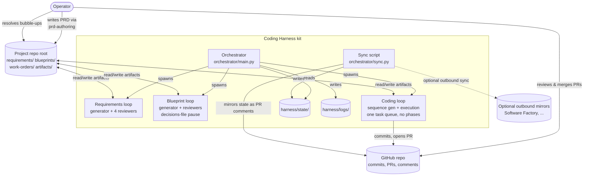
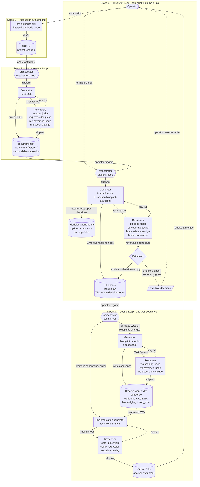

---
cssclasses:
  - wide-mermaid
---

# Coding Harness

## 1. Overview

A reusable harness for running long-horizon software engineering work through Claude Code autonomously, with verification as the primary correctness gate. The project goes through four stages — one manual, three autonomous:

1. **Manual PRD authoring.** Operator writes a single `PRD.md` at the project repo's root with the `prd-authoring` skill (interactive, Claude-assisted). One monolithic prose document.
2. **Requirements Loop** (autonomous). Reads the root `PRD.md` and decomposes it into the full structural tree: product-overview sections (business problem, personas, product description, success metrics, etc. — the `requirements/overview/` tree) *and* Feature Requirements Documents (`requirements/features/` tree). Reviews against four rubrics (spec structure, cross-doc consistency, PRD-coverage, feature scoping) and iterates until all pass.
3. **Blueprint Loop** (autonomous, with non-blocking user bubble-ups). Produces technical blueprints from approved FRDs. When the generator hits a decision that requires operator judgment (tech stack, major architecture pattern), it records the decision in `blueprints/_decisions-pending.md` — pre-populated with options and pros/cons so the operator can scan and pick quickly — and keeps generating everything else, leaving TBD markers where the decision matters. The loop exits either when all reviewers pass and there are no open decisions (full pass), or when it has done as much as it can and can't make further progress without operator input (`awaiting_decisions`). The operator reviews the decisions doc at leisure, fills in choices, and re-triggers the loop. Cycle continues until all decisions are resolved and all reviewers pass.
4. **Coding Loop** (autonomous). Auto-generates an ordered work-order sequence from approved blueprints, then executes each work order in dependency order on `task/<id>` branches with its own reviewer stack and PR-per-work-order flow. No phases — one continuous task sequence. This materially differs from SF's human-team model; our work orders are agent-consumed and can be much finer-grained, more ordered, and more mechanical.

Each autonomous loop has the same shape: generator session → reviewer subagent fan-out → pass/fail aggregation → fix-and-retry until all pass → artifact committed. Identical plumbing (state files, verdict trailers, PR comment mirroring) across all three.

The harness drives the Claude Code CLI as a subprocess from a Python orchestrator. Canonical state lives on disk at the project repo's root; the entity layout mirrors Software Factory's model so upload to SF is mechanical (see §6.2).

**One repo per project.** The coding_harness repo itself is a reusable kit (orchestrator, skills, template). Each project the harness runs against is its own git repo, with `requirements/`, `blueprints/`, `work-orders/`, `artifacts/`, and `harness/` trees at its root. The orchestrator runs with the project repo as its working directory.

Local files are the source of truth. External systems like Software Factory are optional outbound mirrors, never alternative queues.

The user authors the PRD and supervises bubble-ups; the harness does everything else.

## 2. Goals & Non-Goals

### Goals
- Solve verification as a first-class concern so long-running autonomous work becomes trustworthy at *every* stage — requirements, blueprints, and code.
- Drive Claude Code via its CLI to leverage the Claude Max subscription and inherit every Claude Code improvement for free.
- Keep the orchestration surface small: thin Python loop + rich in-session hooks/skills/agents. The same loop runs all three autonomous phases, parameterized by which generator + reviewers to spawn.
- Local-first. Canonical PRD, FRDs, blueprints, work orders, and execution state live at the project repo's root as markdown + meta files, structured to mirror Software Factory's entity model so upload to SF (or any future external system) is mechanical.
- Autonomous where structure is clear; human where judgment is irreplaceable. The PRD is human. Bubble-ups during blueprint synthesis are human. Everything else is autonomous.
- Polished, self-maintainable documentation and code for long-term single-operator use.

### Non-Goals
- Multi-user, team, or OSS-release polish. Personal tool.
- Cross-agent portability (Cursor, Aider, Codex). Claude Code only.
- Autonomous PRD writing. The PRD is the operator's voice; skills assist but the operator drafts.
- L1-only or L2-only shapes. This is an L3 (autonomous loop) product at three levels.
- Token-level cost optimization. Subscription model; wall-clock time is the budget unit.
- Replacing Claude Code features (Plan Mode, subagents via Task tool) with reimplementations. Use them where they fit.

## 3. Design Principles

1. **Every generation step is a gen/review loop.** The same pattern — generator writes, reviewers judge, generator fixes — runs at three levels: requirements, blueprint, code. One loop mechanic, three sets of reviewers. Autonomy lives *inside* each loop; handoffs between loops are discrete, operator-visible gates.
2. **Verification and generation quality are co-equal.** The harness must confirm the artifact is correct (verification) *and* that it will hold up as input to the next loop (quality). A passing but incoherent FRD wrecks the blueprint loop; a passing but hand-wavy blueprint wrecks the coding loop. The reviewer stack at each level is designed to prevent the downstream failure, not just the local one.
3. **Claude Code is the runtime.** The orchestrator never makes direct Anthropic API calls. Every model interaction happens through `claude -p`.
4. **In-session work uses hooks; cross-session work uses Python.** Hooks are deterministic and reactive. The Python orchestrator is the only thing that initiates sessions, transitions state, enforces budgets, and detects bubble-up pauses.
5. **The artifacts are ground truth.** Reviewers never trust generator self-reports. They read the written files (or `git diff` in the coding loop) and run gates.
6. **Local files are the source of truth; external backends are optional outbound mirrors.** The canonical PRD, FRDs, blueprints, work orders, and execution state live at the project repo's root (`requirements/`, `blueprints/`, `work-orders/`, `artifacts/`, `harness/`). The orchestrator always reads from and writes to local files. Software Factory (or any future system) is a sync target, never the queue itself.
7. **Machine-readable state for agents; human-readable artifacts for the operator.** Agents read and write JSON in `harness/state/`; the operator authors and reads markdown + meta files in the rest of the project repo. A sync script mirrors updates to PR comments on GitHub and, when configured, to external mirrors.
8. **Bubble-ups are first-class, and non-blocking.** The blueprint loop expects the generator to identify decisions that require the operator (tech stack, major architecture). It records each decision in `blueprints/_decisions-pending.md` — pre-populated with options + pros/cons + a recommended default, scan-and-pick — and keeps generating everything else. The loop only stops when it has done as much as it can without those decisions. The operator resolves decisions asynchronously; subsequent loop runs consume the answers and keep going.

## 4. Architecture

### 4.1 Component map



### 4.2 Layers of responsibility

| Concern | Owner |
|---|---|
| PRD / Product Overview authoring | Operator + `prd-authoring` skill (manual, interactive) |
| FRD decomposition + review + iteration | Requirements loop (§5.2) |
| Blueprint synthesis + review + iteration, decision bubble-ups | Blueprint loop (§5.3) |
| Work-order generation + scoping, per-work-order code execution | Coding loop (§5.4) |
| Canonical artifacts (PRD, FRDs, blueprints, work orders) | Local files at project repo root |
| Next-loop selection, status transitions, budget enforcement, session lifecycle, bubble-up pause detection | Python orchestrator |
| Cross-session memory, handoff context | `harness/state/<id>.json` |
| In-session enforcement: verdict-trailer validation, preventing premature stop | Claude Code hooks |
| Reusable capabilities: generator prompts, reviewer judges, authoring assist | Skills |
| Operator-invoked entry points | Slash commands |
| Role-specialized session prompts | Agents (`.claude/agents/*.md`) |
| Ground truth about what changed | Git |
| Human audit trail | GitHub PR comments + git history (via sync script) |
| External system mirrors (SF, etc.) | Sync script (outbound only, optional) |

## 5. Project Lifecycle

One project, end to end. Four stages: a manual PRD-authoring stage followed by three autonomous loops. Each loop uses the same gen/review/fix-until-pass mechanic; only the generator, the reviewers, and the artifact differ.



Each loop reads left-to-right, top-to-bottom: orchestrator spawns a generator via `claude -p`; generator does its work (writing/editing files, committing in the coding loop); generator fans out reviewer subagents via the Task tool; reviewers return verdicts; any `fail` sends the generator back to iterate inside the same session; all `pass` commits the artifact and exits. Every reviewer subagent pulls in `autonomous-execution`; every generator pulls in `autonomous-execution` plus loop-specific skills. The orchestrator enforces a wall-clock cap per subprocess.

The three loops share state-file plumbing, verdict-trailer format, PR-comment mirroring, and budget enforcement. They differ in: generator skill, reviewer set, target artifact tree, and (for the blueprint loop) the dual completion condition (all reviewers pass AND decisions-doc empty).

### 5.1 Stage 1 — Manual PRD authoring

The operator opens a Claude Code session, invokes the `prd-authoring` skill, and drafts a single `PRD.md` at the project repo's root. One monolithic document in prose. The skill is modeled on SF's `requirements_agent` (role as expert PM, feature-unit scoping definition, clarification policy) but adapted for producing one file rather than navigating a live document tree.

**Critique is conversational, not a separate skill.** Unlike SF — which exposes `review_document` and `review_across_documents` as discrete UI overlays — the harness keeps review inside the same authoring session. The operator just asks the agent to review what's written ("what's missing?", "critique this section", "check for contradictions") and the skill responds with a five-category rubric, filtered to critical-only:

- **CONFLICT** — direct contradictions within the PRD.
- **MISSING** — critical product-level gaps blocking understanding.
- **AMBIGUOUS** — genuine confusion about user experience or feature behavior.
- **DUPLICATION** — significant duplicated content needing consolidation.
- **STALE** — refactor residue that only makes sense against a prior version: `(unchanged)` / `(existing)` annotations, breadcrumbs like "previously…" or "the old X", references to renamed artifacts, external file/repo paths a fresh reader can't resolve. Downstream agents can't reconstruct this context; flag and remove.

This works because the operator is already conversing with the agent; forcing a skill boundary would be friction. The autonomous requirements loop downstream (`req-coverage-judge` etc.) catches anything that slipped through.

No autonomous loop here — authoring the PRD is the human's job. The PRD is the only artifact the operator writes by hand; everything downstream is generated.

When the PRD is ready, the operator triggers the Requirements Loop.

### 5.2 Stage 2 — Requirements Loop (autonomous)

**Trigger.** `python -m orchestrator requirements-loop`.

**Generator.** A single `claude -p` subprocess running with the `prd-to-frds` skill. It reads `PRD.md` and decomposes it into the full structural tree. Two output surfaces:
- **Product-overview sections** (`requirements/overview/{section-slug}/`). The generator identifies the structural pieces of the PRD — business problem, current state, personas, product description, success metrics, measurement, phases, audit/compliance, technical requirements, appendix — and writes each as its own overview node with `.overview.meta.yaml`, `.requirements.meta.yaml`, and `document.md`. Exactly mirrors bnl's shape.
- **Feature Requirements Documents** (`requirements/features/{feature-slug}/`). One FRD per feature identified in the PRD, following the feature-unit definition (standalone value, implementation footprint, independent deployability, incremental value — lifted from SF's scoping guidelines). Parent/child nesting under `children/` when features decompose further.

The generator is iterative: reads any existing overview+features trees first and edits what needs changing rather than regenerating from scratch on every run.


**Reviewers** (fanned out via Task tool after the generator believes it's ready):
- `req-spec-judge` — each FRD (and overview section) matches structural expectations (sections present, requirements have REQ-IDs + user stories + acceptance criteria in testable form; overview prose is narrative not bullety).
- `req-cross-doc-judge` — whole-tree consistency. Contradictions between FRDs, terminology drift, duplication that should be consolidated.
- `req-coverage-judge` — the union of overview + features covers the PRD's scope without gaps or overlaps. Reads root `PRD.md` and compares against the generated tree. This is the load-bearing check — bad coverage wrecks the blueprint loop.
- `req-scoping-judge` — each FRD individually passes the feature-unit definition (standalone value, independent deployability, parent/child correctness).

**Loop mechanic.** Any gate `fail` → generator reads the rationales, edits the tree, re-runs the fan-out. All pass → generator emits `VERDICT:` trailer and exits.

**Output.** Approved `requirements/overview/` and `requirements/features/` trees. State file records the iteration history. No PR is opened — the requirements tree is documentation; git commit history is the audit trail. The operator verifies the final state (`git diff`) before triggering the blueprint loop.

### 5.3 Stage 3 — Blueprint Loop (autonomous, non-blocking bubble-ups)

**Trigger.** `python -m orchestrator blueprint-loop`.

**Generator.** Running with `frd-to-blueprint` and `foundation-blueprint-authoring`. For each FRD in `requirements/features/`, it produces a feature blueprint. For shared concerns spanning multiple features (auth, data model, error handling, observability), it produces foundation blueprints first so feature blueprints can reference them without duplicating shared concerns. Output under `blueprints/` (layout deferred — see §8).

**Open design.** Blueprint artifact shape diverges from SF's — SF's blueprints are authored for humans who will read, debate, and hand off to teams; ours are read by an autonomous coding loop. Ours need tighter contracts (explicit interfaces, listed invariants, machine-readable dependency graphs) and less discursive prose. Pinning this is §8 work and happens at the start of the v0.2 milestone.

**Non-blocking bubble-up mechanism.**

Some decisions can't be made autonomously — tech stack, framework choice, hosting model, auth provider, ORM choice, major architectural pattern. The blueprint generator **does not stop when it hits one**. Instead:

1. Generator writes (or appends to) `blueprints/_decisions-pending.md`. Each open decision is a self-contained block with:
   - **Title** — the decision, one line.
   - **Context** — which FRD or foundation concern needs it, one paragraph.
   - **Options** — 2–4 pre-researched choices, each with a one-sentence summary and a `Pros` / `Cons` pair. The generator does the homework so the operator doesn't have to.
   - **Recommended default** — which option the generator would pick and why, one paragraph.
   - **Your choice** — a blank field for the operator to fill in.
2. Generator keeps working. Where the decision matters, the blueprint gets a `TBD: <decision-title>` marker referencing the pending decision. The generator produces as much of the rest of the blueprint tree as it can — everything independent of the decision is completed.
3. Generator fans out reviewers as normal. Reviewers may pass on everything that's concrete; `bp-decision-judge` specifically tracks which open decisions the generator did vs didn't bubble up properly.
4. Generator aggregates. Two possible exit verdicts now:
   - **`VERDICT: pass`** — all reviewers pass *and* `_decisions-pending.md` has no unanswered decisions. Full completion.
   - **`VERDICT: awaiting_decisions`** — reviewers pass on the current state, but open decisions remain and the generator can make no further progress without them. The orchestrator writes out the loop state, summarizes the pending decisions, and exits.
   - (Plus the standard **`fail`** and **`exhausted`** verdicts, which behave as in other loops.)
5. Operator reviews `blueprints/_decisions-pending.md` at their leisure. The doc is designed for fast scanning — decisions at a glance, pre-populated options, recommended default. Operator fills in each `Your choice:` line. Optionally renames resolved blocks to `_decisions-resolved-<timestamp>.md` for git-history audit, or leaves them in place for the generator to detect.
6. Operator re-runs `python -m orchestrator blueprint-loop`. Generator reads the decisions doc, treats any answered decisions as resolved, picks up where it left off. Repeats the cycle until full `pass`.

The decisions file is the operator's async sync point with the loop. Treating it as an artifact (in git, in the blueprints tree) means it's versioned, mirror-surfaceable, and never gets lost.

**Reviewers:**
- `bp-spec-judge` — each blueprint matches structural expectations (interfaces, data model, dependencies, invariants — exact shape pinned in v0.2).
- `bp-coverage-judge` — every approved FRD has a blueprint; every foundation concern referenced by a feature blueprint is defined; TBD markers only appear where a decision is pending.
- `bp-consistency-judge` — cross-blueprint contracts align. Feature A's "depends on Auth service v2" matches foundation Auth blueprint's version.
- `bp-decision-judge` — checks two things: (a) that no high-impact decisions were made silently by the generator without bubble-up, and (b) that every `TBD: <decision-title>` marker corresponds to an open block in `_decisions-pending.md`.

**Output.** Approved blueprints under `blueprints/` when all decisions are resolved and all reviewers pass. Commit history is the audit trail.

### 5.4 Stage 4 — Coding Loop (autonomous)

**Trigger.** `python -m orchestrator coding-loop`.

No phases — one continuous task sequence. The loop reads approved blueprints, produces an ordered sequence of work orders, and then drains that sequence in dependency order. Work-order generation and work-order execution are just sequential steps in the same loop, both using the same gen/review/fix-until-pass mechanic.

This materially differs from Software Factory. SF's work orders are grouped into phases for a human team's scheduling; ours are consumed by a sequential autonomous executor, so `blocked_by[]` + `sort_order` encode everything we need and phase grouping is dead weight.

**Sequence generation** (runs once at the start of a `coding-loop` invocation whenever there are no ready work orders OR blueprints have changed since the last generation — recorded as a hash in `work-orders/.sequence.meta.yaml`):

- Generator runs with `blueprint-to-tasks` and `scope-task`. Reads every approved blueprint, produces an ordered list of work orders, scopes each one into the standard scoped-task body (§5.4.1), and writes them to `work-orders/wo-NNN/` with proper `blocked_by[]` and `sort_order` in each `.work-order.meta.yaml`. Existing work orders are read first so partial regeneration works (blueprint change → only the affected work orders are re-scoped).
- Reviewers fan out: `wo-scoping-judge` (each WO atomic, observable outcome, doesn't bundle), `wo-coverage-judge` (union of work orders covers every blueprint's delivery surface), `wo-dependency-judge` (graph acyclic, no reference to not-yet-produced interfaces, sort order consistent with dependencies).
- On pass, all work orders land with `status: ready`.

**Open design.** Work-order artifact shape diverges from SF's. SF's are sized for a human with tribal knowledge; ours are sized for an autonomous Claude Code session with explicit context. Ours therefore need tighter scope, more explicit acceptance criteria, machine-readable dependency graph, no ambiguity in "In scope"/"Out of scope", explicit verification hooks. Pinning the exact shape happens at the start of v0.3 — see §8.

**Sequence execution** (drains the ready queue in dependency order, one work order per orchestrator subprocess):

1. Orchestrator selects the next ready work order whose `blocked_by[]` dependencies are all `done` (ordered by `sort_order` as a tiebreaker). Moves it to `in_progress`, initializes `harness/state/<task_id>.json`, sets `execution.branch = "task/<task_id>"`.
2. Orchestrator spawns one generator subprocess — `claude -p "<prompt>"` with the scoped-task body injected inline. A single subprocess per work order; the generator handles its gen/review cycle internally.
3. Generator works on branch `task/<task_id>`. First pass commits, pushes, opens a PR.
4. Generator fans out reviewers via Task tool: `tests`, `playwright`, `spec-judge`, `regression-judge`, `security-judge`, `quality-judge`. Each returns verdict + rationale.
5. Generator aggregates.
   - Any `fail` → read rationales, fix, push, re-fan-out. Retry loop internal to the session.
   - All `pass` → emit final `VERDICT:` trailer, exit.
   - Budget: wall-clock cap on the subprocess.
6. Orchestrator post-processes:
   - `gh pr list --head task/<task_id>` → populate `execution.pr_url` / `execution.pr_number`.
   - Capture stdout into `current.last_output`; rotate prior `current` to `history`.
   - Post final summary as a PR comment.
7. Operator reviews and merges when satisfied. The harness never auto-merges.
8. On the next orchestrator invocation: check each `in_progress` work order for a merged PR (by branch name); transition to `done`. Select next ready work order. Continue.

**Queue drain.** By default, a single `coding-loop` invocation drains all work orders whose dependencies are ready, in order. A `--one` flag runs one work order and exits. A `--gen-only` flag runs only the sequence-generation step without executing any implementation.

#### 5.4.1 Scoped-task format

Every work-order body is in this shape. The `scope-task` skill produces it during sequence generation; the operator (or a failing sequence-gen reviewer) can edit it. Consistent format means the implementation generator always knows where to find each piece of information.

```markdown
## Goal
One sentence describing what this work order delivers.

## In scope
- Bullet list of what is included.

## Out of scope
- Explicit list of what this work order does NOT cover, especially things a reasonable reader might assume are included. Forces the scope boundary to be thought through.

## Depends on
- #<other-wo> — one line explaining what this work order needs from it.
(Empty if no dependencies.)

## Produces
- Interfaces, modules, artifacts, or contracts this work order makes available for downstream work orders.

## Acceptance criteria
- [ ] Observable outcomes, each verifiable by the reviewer's gates.
- [ ] ...

## Implementation notes (non-binding)
Optional. Hints about files, approach, libraries. Never prescriptive — the generator owns implementation choices.
```

**Scope is the load-bearing concept.** All scopes across all work orders must compose into the whole blueprint surface without gaps or overlap. `In scope` + `Out of scope` + `Produces` carry the contract. If scoping is sloppy, work orders either leave gaps or double up — both wreck execution. `wo-coverage-judge` and `wo-scoping-judge` during sequence generation are the last line of defense before this propagates into execution.

#### 5.4.2 Gap filing

Any autonomous-loop session (requirements, blueprint, or coding) can file a gap when it encounters out-of-scope missing work. The capability keeps the harness honest about what it's seeing without blowing the current artifact's scope. Most common in the coding loop; possible in the others.

**When it fires** (agent judgment, guided by `autonomous-execution`):
- Coding generator finds a prerequisite that isn't in place ("this endpoint needs a shared auth middleware that doesn't exist yet; not in scope for this work order").
- Any generator or reviewer notices a latent issue adjacent to the area being changed.
- Reviewer sees a concern outside the artifact's declared `In scope` — code smell, test gap, missing FRD coverage, blueprint inconsistency — something important but not this session's job.

**What the agent does:** calls the `file-gap` skill with a title, a body describing the gap, and (optionally) a category hint like `refactor | bug | security | infra | requirements | blueprint`.

**What the skill does mechanically:**
1. Allocates the next `wo-NNN` number for the project (zero-padded for lexicographic sort).
2. Creates `work-orders/_inbox/{wo-n}/` containing `description.md` (the body) and `.work-order.meta.yaml` (`status: backlog`, `type` from the category hint, `parent_id` set to the originating work order's id when in the coding loop, or a note of the originating FRD/blueprint path when in the upstream loops).
3. Description includes a back-reference.
4. Returns the new work order's path to the agent so it can mention it in its final output.

**What the skill does NOT do:**
- Does not promote the gap to `ready` — operator triages.
- Does not affect the current iteration's verdict — gap filing is a side effect, not a gate signal.
- Does not trigger a new session — the orchestrator ignores the new work order until a future run picks it up.
- Does not dedupe (v1). If two sessions file similar gaps, both exist. Operator merges/closes during triage.

**Where gaps show up:**
- Local planner: under `work-orders/_inbox/`, distinguished by their `_inbox` placement and `parent_id` / back-reference.
- Originating PR (coding loop only): the agent mentions `Filed wo-99 for [...]` in its prose, which lands in the PR comments.
- State file `history[]`: the prose is preserved there too.

**Guardrails for in-scope vs gap:** the agent checks the current artifact's scope (work order `In scope` / `Out of scope`, FRD sections, blueprint contracts) before filing. Plausibly in-scope → in-line, don't file. Plausibly out → file. Ambiguous → file (cheap, reversible) and continue.

## 6. Components

### 6.1 Python orchestrator

Entry points (subcommands off `python -m orchestrator`):
- `requirements-loop` — drives Stage 2 (§5.2).
- `blueprint-loop` — drives Stage 3 (§5.3).
- `coding-loop` — drives Stage 4 (§5.4).
- `status` — prints current loop state, bubble-up pauses, ready-work-order count.

The operator runs one subcommand at a time. Loops are not daemons.

Responsibilities shared across all three loop subcommands:
- Load `config.yaml` from the project repo root (mirrors, repo, caps, paths).
- Instantiate `LocalPlanner()` (defaults to CWD = project repo root) and any configured `Mirror` adapters.
- Build a loop-specific generator prompt (skill list, artifact tree to read/write, prior `current.last_output` if any, loop-specific context).
- Spawn `claude -p "<prompt>"` as a single subprocess; the generator handles its own gen/review retry loop via Task-tool reviewer fan-out.
- Enforce a wall-clock cap on the subprocess; kill and mark as `exhausted` if exceeded.
- After the subprocess exits: capture stdout, parse the `VERDICT:` trailer, rotate `current` → `history`, post mirrors.

Loop-specific flow:

**`requirements-loop`:**
1. Check `PRD.md` exists at the repo root; if not, exit with "no PRD drafted yet — run `prd-authoring` first."
2. Load or initialize `harness/state/requirements-loop.json`.
3. Spawn generator with `prd-to-frds` + `autonomous-execution`; the generator reads `PRD.md` + any existing `requirements/overview/` and `requirements/features/`, and writes/edits both trees.
4. On generator exit: record verdict; if `pass`, commit the requirements-tree changes; if `fail`, leave state in place for the operator to inspect.

**`blueprint-loop`:**
1. Load or initialize `harness/state/blueprint-loop.json`. Read `blueprints/_decisions-pending.md` if it exists, to include in the generator's prompt (so it sees the current set of open decisions and any `Your choice:` answers the operator has filled in since the last run).
2. Spawn generator with `frd-to-blueprint` + `foundation-blueprint-authoring` + `autonomous-execution`. Generator reads FRDs, existing blueprints, and the decisions doc; writes/edits `blueprints/`; appends to or prunes `_decisions-pending.md` as it makes progress.
3. On generator exit:
   - `VERDICT: pass` → commit blueprint changes (including any pruned decisions file). Loop done.
   - `VERDICT: awaiting_decisions` → commit current state (blueprints + updated decisions doc). Orchestrator prints a summary of the open decisions to stdout and exits. ("Resolved what I can; `blueprints/_decisions-pending.md` has N open decisions for you to answer. Re-run the loop when ready.")
   - `VERDICT: fail` → leave state in place.
   - `VERDICT: exhausted` → wall-clock cap hit; leave state, log, exit.

**`coding-loop`:**
1. Detect any `in_progress` work orders whose PR was merged since last run; transition to `done`. (Done before anything else so the queue view reflects reality.)
2. Check whether a sequence-generation step is needed: no ready work orders, or blueprints hash changed since the last `work-orders/.sequence.meta.yaml` write. If yes:
   - Spawn generator with `blueprint-to-tasks` + `scope-task` + `autonomous-execution`. Generator reads blueprints and writes/edits `work-orders/wo-NNN/`.
   - On pass, commit work-order changes, update `.sequence.meta.yaml` with the blueprints hash, fall through to execution.
   - On fail/exhaust, exit.
3. Drain the ready queue (one work order per orchestrator subprocess):
   - `planner.get_next_ready()` — returns a work order whose `blocked_by[]` are all `done`, ordered by `sort_order`. None → exit 0.
   - Move to `in_progress`; initialize `harness/state/<task_id>.json`; set `execution.branch = "task/<task_id>"`.
   - Build generator prompt and spawn `claude -p "<prompt>"`. Generator commits, opens PR, fans out coding reviewers, iterates.
   - After subprocess exit: `gh pr list --head task/<task_id>` → populate `execution.pr_*`; rotate state; post PR comment.
   - By default, drain. `--one` runs one work order. `--gen-only` runs only the sequence-generation step and exits before execution.

Scope constraints:
- No direct LLM calls. All model interactions happen via `claude -p` subprocesses.
- No edits to application source files. Only writes inside `harness/`, plus artifact commits via `git` (which the orchestrator triggers after a loop passes; the generator writes the files in-session).
- Everything else is permitted: subprocess management, prompt construction, stdout capture, state-file rotation, `gh`/`git` queries, PR comment posting, status transitions, bubble-up pause detection.

Target: ≤ 600 lines of Python across the orchestrator. The three loop subcommands share 80% of their code — the shared path is the per-loop gen/verify/exit mechanic; the delta is prompt construction, artifact dir, and verdict semantics (notably `awaiting_decisions` in the blueprint loop and the sequence-gen-then-drain structure in the coding loop).

### 6.2 Local planner + optional outbound mirrors

The canonical task queue lives on disk at the project repo's root. One repo per project. The orchestrator reads from and writes to this layout directly — there is no abstraction layer between the orchestrator and the local files, because there is only one queue. Pluggability lives at a separate, optional outbound sync layer: zero or more `Mirror` adapters that push local state to external systems (Software Factory, GitHub Projects, etc.). Mirrors are convenience; local persists regardless.

#### 6.2.1 On-disk layout

The shape mirrors Software Factory's entity model so that upload to SF (or any system that adopts a similar shape) is mechanical. Everything below lives at the project repo's root:

```
<project-repo-root>/
  PRD.md                               # single monolithic PRD authored by the operator (Stage 1)
  requirements/                        # generated in Stage 2 from PRD.md
    overview/{section-slug}/
      .overview.meta.yaml              # id, parent_id, position, title
      .requirements.meta.yaml          # id
      document.md                      # one PRD section (business problem, personas, ...)
      children/{child-slug}/...        # nested OverviewNodes (recursive, only if present)
    features/{feature-slug}/
      .feature.meta.yaml               # id, parent_id, position, title
      .requirements.meta.yaml          # id
      document.md                      # FRD body
      children/{child-slug}/...        # nested FeatureNodes (recursive, only if present)
  blueprints/                          # generated in Stage 3
    _decisions-pending.md              # only present while decisions are open (§5.3)
    _decisions-resolved-*.md           # optional audit-log of resolved decisions
    ...                                # foundation + per-feature blueprints; layout TBD (§8)
  work-orders/                         # generated in Stage 4 (flat, no phase groupings)
    .sequence.meta.yaml                # blueprints hash + generation timestamp (for change detection)
    wo-NNN/
      description.md                   # scoped-task body (§5.4.1)
      .work-order.meta.yaml            # id, status, priority, type, parent_id, sort_order, blocked_by[], blueprint_ids[]
      children/                        # subtasks (rare; most work orders are leaf)
    _inbox/                            # gaps filed by any loop (§5.4.2); operator triages
  artifacts/{folder-slug}/...          # Artifact folder tree
  harness/
    state/<task_id>.json               # per-work-order state (§6.3)
    state/requirements-loop.json       # loop-level state
    state/blueprint-loop.json          # loop-level state
    state/coding-loop-seq-gen.json     # loop-level state for the sequence-generation step
    logs/<task_id>/...                 # hook/session logs
```

**Key shape facts:**
- **`PRD.md` at root.** The operator-authored monolithic PRD (Stage 1). Input to the requirements loop; never edited by any autonomous loop.
- **`requirements/` is generated.** Flat `overview/` and `features/` sibling trees under it. Each node directory holds its meta + `document.md` flat. `.requirements.meta.yaml` is `{id}` only. `children/` only exists when a node has actual children.
- **`work-orders/` is flat** (no phase groupings). Work-order directories sort lexicographically by `wo-NNN` name with leading zeros; `sort_order` in `.work-order.meta.yaml` provides the canonical order; `blocked_by[]` provides dependency constraints. Together these encode everything SF used phase groupings for.
- **`.sequence.meta.yaml`** at the work-orders dir level records the hash of the blueprint tree at the time the sequence was generated. On each `coding-loop` run, the orchestrator compares the current blueprint hash to this; if changed, it triggers a regeneration before draining.

A reference skeleton lives at `project-template/` inside this kit repo. Clone it into a new project repo to start.

Blueprint and work-order subtrees are sketched above but their concrete document shapes are TBD (§8) — only `requirements/` has been pinned to the real SF-mirrored layout. Blueprint layout lands in v0.2; work-order shape lands in v0.3.

**Versioning:** none locally. Git history is the audit trail. SF maintains immutable per-save snapshots (`RequirementsDocumentVersion`, `BlueprintDocumentVersion`, `WorkOrderVersion`); when the upload API ships, the mirror serializes only the current document state and lets SF create the version on its end.

#### 6.2.2 Local planner module

A thin Python module (`orchestrator/planner.py`) reads and writes the on-disk layout. Single concrete class — no Protocol, no plug-in surface — because there is only one queue.

```python
Status = Literal["backlog", "ready", "in_progress", "done"]

class WorkOrder(TypedDict):
    task_id: str                  # "wo-42", scoped within project
    title: str
    description_markdown: str     # full description.md contents
    status: Status
    priority: str | None
    type: str | None              # BUILD | FIX | REQUIREMENTS | BLUEPRINT | ARTIFACT | OTHER
    parent_id: str | None
    sort_order: str               # lexicographic, for stable ordering
    blocked_by: list[str]
    blueprint_ids: list[str]
    path: Path                    # absolute path to the work-order directory

class LocalPlanner:
    def __init__(self, project_root: Path = Path.cwd()): ...  # project repo root
    def get_next_ready(self) -> WorkOrder | None: ...
    def get(self, task_id: str) -> WorkOrder: ...
    def update_status(self, task_id: str, status: Status) -> None: ...   # writes through to .work-order.meta.yaml
    def get_ordered_ready(self) -> list[WorkOrder]: ...
```

Status updates are written directly to `.work-order.meta.yaml`. The orchestrator is the only writer. Git history is the audit trail — no separate event log needed.

#### 6.2.3 Optional outbound mirrors

A mirror is a one-way adapter that pushes local state to an external system. Mirrors are configured in `config.yaml` and called by the orchestrator at well-defined trigger points (status transition, PR merge, comment post). Zero mirrors is a valid configuration — local-only is the v0.1 default.

```python
class Mirror(Protocol):
    """Outbound sync. Reads local state; writes to an external system."""
    def push_status(self, work_order: WorkOrder) -> None: ...
    def push_comment(self, work_order: WorkOrder, body: str) -> None: ...
```

Planned mirrors:
- `software_factory.py` — pushes work-order status and comments to SF via its upload API once it ships. Already structurally compatible because the local layout mirrors SF's entity model.
- `github_projects.py` — optional read-mostly mirror that surfaces a kanban view on GitHub when off-laptop visibility matters. Deferred.

Mirror constraints:
- One-way only in v1 (push). Inbound sync (operator edits the kanban → local files update) is deferred and may never be built.
- Failures are logged but never block orchestrator progress. Local is the source of truth; mirrors are convenience.
- A mirror failure does not roll back local state. The next successful push reconciles.

`config.yaml` lives at the project repo's root. Example:

```yaml
# project repo root is implicit (CWD when orchestrator runs).

mirrors:                           # empty list = local-only (v0.1 default)
  - kind: software_factory
    base_url: https://sf.internal
    project_id: 0f1e2d3c-4b5a-6978-8765-432101234567
```

#### 6.2.4 Code surface

Code-level operations — branch, push, PR open, PR comment — are always GitHub via `gh` and `git`, wrapped in `orchestrator/git_ops.py`. Not abstracted; not a "backend." The local planner does not know about PRs, and the git layer does not know about work-order metadata. The orchestrator stitches them together.

### 6.3 State file schema

**Two shapes, same plumbing.** Per-work-order state at `harness/state/<task_id>.json` (used by each sequence-execution iteration of the coding loop). Per-loop state at `harness/state/requirements-loop.json`, `harness/state/blueprint-loop.json`, `harness/state/coding-loop-seq-gen.json` (used by the non-per-task loops — including the coding loop's sequence-generation step). Both are JSON with the same top-level fields (`current`, `history`, `verification`, `limits`); the per-task files additionally carry `local.*` and `execution.*` blocks specific to the work order being executed. Loop-level files have a single logical "task" that is the loop itself.

Below is the per-task schema. Loop-level state files drop `local.*` and `execution.*` and substitute `loop.name` (e.g. `"requirements"` / `"blueprint"` / `"coding-seq-gen"`) and `loop.artifact_paths[]` (e.g. `["requirements/features/"]`). Every other field behaves identically.

The entire `harness/` directory (`state/`, `logs/`, `cache/`, `index.md`) is **committed to git**. It is a permanent record of every task, every iteration, every verdict, and every hook firing — treated as first-class project artifact, not runtime scratch. Future uses include training data, fine-tuning signals, failure-mode analysis, and operator audit. Log files are the only entries that may be compressed or pruned on a documented retention policy; state files are never deleted.

Format:

```json
{
  "task_id": "wo-42",
  "local": {
    "title": "Add login endpoint",
    "path": "work-orders/wo-42/",
    "blueprint_ids": ["bp-uuid-1"]
  },
  "created_at": "2026-04-18T10:00:00Z",
  "updated_at": "2026-04-18T10:45:12Z",
  "status": "in_progress",
  "session_count": 1,

  "limits": {
    "max_wall_minutes": 120
  },

  "execution": {
    "branch": "task/wo-42",
    "pr_url": "https://github.com/owner/repo/pull/123",
    "pr_number": 123
  },

  "current": {
    "last_role": "generator",
    "last_output": "Ran all six reviewer subagents after three internal fix passes.\n\nRound 1: tests pass, spec-judge failed on acceptance criterion 2 — /login accepted empty passwords. Added pydantic validation and a test for empty/missing fields.\n\nRound 2: spec-judge passed, quality-judge flagged duplication between validation logic in /login and /signup. Extracted shared validator into auth/validators.py.\n\nRound 3: all six gates passed. PR https://github.com/owner/repo/pull/123 is ready for operator review."
  },

  "verification": {
    "tests":              { "result": "pass", "ran_at": "2026-04-18T10:43:00Z" },
    "playwright":         { "result": "pass", "ran_at": "2026-04-18T10:44:00Z" },
    "spec_judge":         { "result": "pass", "ran_at": "2026-04-18T10:44:10Z" },
    "regression_judge":   { "result": "pass", "ran_at": "2026-04-18T10:44:20Z" },
    "security_judge":     { "result": "pass", "ran_at": "2026-04-18T10:44:30Z" },
    "quality_judge":      { "result": "pass", "ran_at": "2026-04-18T10:44:40Z" }
  },

  "history": [
    { "session": 1, "at": "2026-04-18T10:45:00Z", "verdict": "pass", "output": "(full text of the generator's final summary for this session)" }
  ],

  "mirror": {
    "last_posted_session": 1,
    "last_mirrored_at": "2026-04-18T10:45:30Z"
  }
}
```

Loop-level state file example (`harness/state/blueprint-loop.json`):

```json
{
  "loop": {
    "name": "blueprint",
    "artifact_paths": ["blueprints/"]
  },
  "created_at": "2026-04-19T09:00:00Z",
  "updated_at": "2026-04-19T09:32:00Z",
  "status": "awaiting_decisions",
  "session_count": 2,
  "limits": { "max_wall_minutes": 60 },
  "current": {
    "last_role": "generator",
    "last_output": "Produced 4 feature blueprints and 2 foundation blueprints (with TBD markers for 3 open decisions). Reviewers passed on all concrete content. 3 open decisions remain in blueprints/_decisions-pending.md: auth provider, database engine, deploy target."
  },
  "verification": {
    "bp_spec_judge":        { "result": "pass", "ran_at": "2026-04-19T09:31:10Z" },
    "bp_coverage_judge":    { "result": "pass", "ran_at": "2026-04-19T09:31:20Z" },
    "bp_consistency_judge": { "result": "pass", "ran_at": "2026-04-19T09:31:30Z" },
    "bp_decision_judge":    { "result": "pass", "ran_at": "2026-04-19T09:31:40Z" }
  },
  "open_decisions": 3,
  "history": [
    { "session": 1, "at": "2026-04-19T09:15:00Z", "verdict": "awaiting_decisions", "open_decisions": 5, "output": "..." },
    { "session": 2, "at": "2026-04-19T09:32:00Z", "verdict": "awaiting_decisions", "open_decisions": 3, "output": "..." }
  ]
}
```

`status` on loop-level state adds `awaiting_decisions` to the canonical enum (blueprint loop only).

Field rules:
- `task_id` is the harness-stable identifier used everywhere in `harness/` paths, log names, and cross-references. Format: `wo-NNN` (per-project work-order number, zero-padded for lexicographic sort).
- `local.*` is a denormalized snapshot of the work order's location and identity in the project repo. `path` is relative to the project repo root. Refreshed by the orchestrator from `.work-order.meta.yaml` on every read; never edited by hand. The on-disk meta file is canonical; this block is a convenience copy.
- `status` uses the canonical enum: `backlog` | `ready` | `in_progress` | `done`. Mirrors `.work-order.meta.yaml`.
- `session_count` — how many generator sessions this task has required. Usually 1; increments only if the orchestrator has to respawn (timeout, crash).
- `limits.max_wall_minutes` — outer time cap on the generator subprocess. The orchestrator kills the subprocess if it exceeds this. Internal retry count is not capped explicitly; wall time is the backstop.
- `current.last_output` — the full verbatim stdout of the most recent generator session.
- `current.last_role` — always `generator` (reviewer subagents don't produce top-level output). Retained for forward compatibility if we ever add other top-level roles.
- `verification.<gate>.result` — populated by the orchestrator from the generator's final VERDICT block. Each `pass | fail | not_run`.
- `history` — append-only, one entry per generator session. Carries the full `output` text and the session-level `verdict` (`pass | fail | exhausted`). Powers replay, audit, and future training data. Never truncated in place.
- `execution.branch` is set by the orchestrator before spawning. `execution.pr_url` / `pr_number` are populated after the subprocess exits via `gh pr list`.
- `mirror.last_posted_session` tracks which `history[]` sessions have been mirrored as PR comments. (External-system mirrors per §6.2.3 maintain their own per-mirror cursors; not stored here.)
- All timestamps are ISO 8601 UTC.
- Schema version implicit in the harness version; breaking changes require a migration step documented in the release notes.

**Write access:**
- The **orchestrator is the only writer** of the state file.
- Per task: orchestrator spawns generator → generator runs (including internal reviewer fan-outs) → generator exits → orchestrator captures stdout, parses gate verdicts, rotates `current` into `history`, refreshes `execution.pr_*`, posts PR comment. Single rotation per orchestrator invocation per task.
- The generator is told in its prompt to end its final message with a structured summary of the per-gate outcomes (see §6.5) so the orchestrator can populate `verification.*` deterministically.
- Per-reviewer-subagent outputs are not directly written to the state file. They live in the Claude Code session transcript (which Claude Code persists on its own) and are referenced by the generator's final summary. If per-subagent persistence is later wanted, a `SubagentStop` hook can capture each subagent's return value into a sibling log file.

### 6.4 Skills

Installed under `.claude/skills/`. Each is a short `SKILL.md` describing when and how to apply it.

**Skills are for LLM-driven work only.** Deterministic mechanics (state-file rotation, iteration counting, history appending, PR comment posting) live in the orchestrator, not in skills. A skill exists in one of two shapes:

- **Tool-wrappers** — reusable "here is how to do X" instructions plus a thin CLI recipe. The agent decides *when* to use the tool; the skill documents *how* consistently.
- **LLM-as-judge** — pure prompting skills that produce a verdict. The judgment is the skill.

**Orientation skill** (pulled in by every autonomously-invoked agent across all three loops — generators and reviewers alike):

- `autonomous-execution` *(orientation)* — sets the baseline posture for any session spawned via `claude -p`:
  - No human is listening. No questions will be answered.
  - When uncertain, make a reasonable decision with the information available and proceed. Prefer action over deliberation.
  - Never end the session by asking a clarifying question, proposing a plan, or waiting for approval. Execute.
  - Read the full state file and prior output before acting; the previous iteration usually contains the signal you need.
  - Be decisive about naming, structure, and stylistic choices. Don't hedge.
  - Block only if truly stuck (missing auth, broken tool, contradiction in the ticket). When blocked: document what you tried, what's missing, and what decision would unblock you, then stop. The orchestrator treats this as a failed iteration.

**Manual-stage skill (operator-driven interactive Claude Code session):**

- `prd-authoring` *(LLM work)* — interactive PRD authoring. Helps the operator draft and refine the single monolithic `PRD.md` at the project repo's root. Output is one file, not a tree — the requirements loop does the decomposition. Role as product manager; clarification policy (ambiguous → ask; specific → act; middle → propose + ≤2 questions); overview-style writing rules (narrative prose, active voice, no fluff, WHAT not HOW); no-fabrication and no-refactor-breadcrumb discipline. The operator writes detailed feature descriptions; formal feature-unit scoping lives in `prd-to-frds`. Uses Claude Code's filesystem tools (Read/Write/Edit). **Also handles critique on demand** — when the operator asks for review, the same skill applies a CONFLICT / MISSING / AMBIGUOUS / DUPLICATION / STALE rubric (critical-only filter) in-line. No separate review skill.

**Requirements-loop skills** (autonomous; `requirements-loop` generator pulls in these):

- `prd-to-frds` *(generator, LLM work)* — reads `PRD.md` at project repo root, decomposes it into the full structural tree under `requirements/` — both `overview/{section-slug}/` (business problem, personas, product description, success metrics, measurement, phases, audit/compliance, technical requirements, appendix) *and* `features/{feature-slug}/`. Applies the feature-unit scoping definition (standalone value, implementation footprint, independent deployability, incremental value) and the split/merge/nest heuristics to turn PRD-level feature descriptions into correctly-scoped FRDs — this is where formal feature shaping lives, not in `prd-authoring`. Iterative: reads existing trees on every session and only edits what needs changing.
- `req-spec-judge` *(reviewer, LLM-as-judge)* — each FRD matches structural expectations: sections present, requirements have REQ-IDs + user stories + testable acceptance criteria. Single-doc check, fanned out once per FRD.
- `req-cross-doc-judge` *(reviewer, LLM-as-judge)* — whole-tree consistency: contradictions between FRDs, terminology drift, duplication across FRDs.
- `req-coverage-judge` *(reviewer, LLM-as-judge)* — union of FRDs covers the PRD's scope without gaps or overlaps.
- `req-scoping-judge` *(reviewer, LLM-as-judge)* — each FRD individually passes the feature-unit definition (standalone value, independent deployability, parent/child semantics).

**Blueprint-loop skills** (autonomous):

- `frd-to-blueprint` *(generator, LLM work)* — per-FRD blueprint writer. Reads existing foundation + feature blueprints first to reuse shared patterns. Writes `TBD: <decision-title>` markers where open decisions block concrete content.
- `foundation-blueprint-authoring` *(generator, LLM work)* — co-invoked by the blueprint-loop generator when a cross-feature concern needs pinning (auth, data model, error handling).
- `bubble-up-decision` *(tool-wrapper)* — appends a structured open-decision block to `blueprints/_decisions-pending.md`: title, context, 2–4 options with pre-researched pros/cons, recommended default, empty `Your choice:` field. Pre-populating options is load-bearing — the operator shouldn't have to do research to pick. Non-blocking — the generator keeps working after calling this.
- `bp-spec-judge`, `bp-coverage-judge`, `bp-consistency-judge`, `bp-decision-judge` *(reviewers, LLM-as-judge)* — per §5.3. The decision-judge verifies (a) no silent decisions and (b) every TBD marker has a matching open block in the decisions doc.

**Coding-loop skills — sequence generation** (autonomous, runs at the start of a coding-loop invocation when needed):

- `blueprint-to-tasks` *(generator, LLM work)* — reads approved blueprints, produces an ordered list of work orders with dependency graph. No phase grouping — flat sequence with `blocked_by[]` + `sort_order`.
- `scope-task` *(generator, LLM work)* — fleshes each work order into the standard scoped-task body (§5.4.1). Co-invoked with `blueprint-to-tasks`.
- `wo-scoping-judge`, `wo-coverage-judge`, `wo-dependency-judge` *(reviewers, LLM-as-judge)* — per §5.4.

**Coding-loop skills — sequence execution** (autonomous, one subprocess per work order — the pre-existing design):

- `open-task-pr` *(tool-wrapper)* — how the generator opens a PR on its first internal pass: branch naming (`task/<task_id>`), commit, push, `gh pr create`. Idempotent.
- `run-playwright-check` *(tool-wrapper)* — how to run Playwright against a locally-booted dev server.
- `spec-judge` *(reviewer, LLM-as-judge)* — compares `git diff` to the work-order's acceptance-criteria checklist.
- `regression-judge` *(reviewer, LLM-as-judge)* — checks the diff for unintended breakage outside the changed lines.
- `security-judge` *(reviewer, LLM-as-judge)* — OWASP-class issues in the diff.
- `quality-judge` *(reviewer, LLM-as-judge)* — structural + textual maintainability of the diff.

**Cross-loop skills:**

- `file-gap` *(tool-wrapper)* — any autonomous-loop session can file a gap when it encounters out-of-scope missing work (§5.4.2). Creates a new `backlog` work order in `work-orders/_inbox/`. Usable from any loop; gaps always land as coding-loop work orders regardless of which loop discovered them (the operator can re-route during triage).

Each LLM-as-judge skill runs as a Task-tool subagent in a fresh Claude Code context — the judge only sees the inputs the generator passes it (file paths, artifact contents, prior rationales), not the generator's session history. Each subagent's return value feeds back into the generator; the generator aggregates them into its final summary.

**Generator ↔ reviewer communication** happens inside the generator's session, via Task-tool fan-out and return values. No state-file round-trip needed within a loop iteration. The state file persists the end-of-iteration summary for operator review and future training data.

**Not skills** (and why):

- State-file rotation, history append, iteration counter, PR comment mirror, `execution.pr_*` refresh, status column transitions, decisions-file presence detection — all deterministic, all orchestrator code.
- Verdict parsing — deterministic trailer parse; orchestrator code.

### 6.5 Hooks

Configured in `.claude/settings.json`. All hooks log to `harness/logs/<task_id>/hooks.log`.

Hooks only do work that **must** happen inside the session — context the orchestrator cannot provide from outside. State management stays in the orchestrator.

- **`Stop` (generator)** — signals completion to the orchestrator; triggers the reviewer fan-out phase. No validation logic here in v1.
- **`Stop` (reviewer subagents)** — defensively checks that each reviewer's output ends with a valid verdict line. If missing or malformed, the hook blocks completion with an error message telling the agent to append the verdict. Catches the failure mode where a reviewer forgets or mangles the verdict, so the aggregator doesn't have to guess.

Not hooks (and why):

- Context injection at session start — the orchestrator builds the full prompt (ticket body, scoped-task body, prior `current.last_output` if any) and passes it as the argument to `claude -p`. No `SessionStart` hook needed.
- State rotation, `history` appending, iteration counting — orchestrator, after the subprocess exits.
- PR comment mirroring — orchestrator (or a separate sync pass).
- `SessionEnd` — nothing for hooks to do; the orchestrator owns post-session work.

**Output formats.**

*Generator final summary.* The generator ends its final message with a `VERDICT:` block. The key set varies by loop; the orchestrator parses the block deterministically against the known reviewer names for the loop it invoked.

```
# requirements-loop
VERDICT:
req_spec_judge: pass | fail | not_run
req_cross_doc_judge: pass | fail | not_run
req_coverage_judge: pass | fail | not_run
req_scoping_judge: pass | fail | not_run

# blueprint-loop (full pass — reviewers passed AND no open decisions)
VERDICT:
bp_spec_judge: pass | fail | not_run
bp_coverage_judge: pass | fail | not_run
bp_consistency_judge: pass | fail | not_run
bp_decision_judge: pass | fail | not_run
open_decisions: 0

# blueprint-loop (awaiting decisions — reviewers pass but decisions still open)
VERDICT: awaiting_decisions
bp_spec_judge: pass
bp_coverage_judge: pass
bp_consistency_judge: pass
bp_decision_judge: pass
open_decisions: 3
decisions_file: blueprints/_decisions-pending.md

# coding-loop sequence generation
VERDICT:
wo_scoping_judge: pass | fail | not_run
wo_coverage_judge: pass | fail | not_run
wo_dependency_judge: pass | fail | not_run

# coding-loop sequence execution (per work order — existing)
VERDICT:
tests: pass | fail | not_run
playwright: pass | fail | not_run
spec_judge: pass | fail | not_run
regression_judge: pass | fail | not_run
security_judge: pass | fail | not_run
quality_judge: pass | fail | not_run
```

The `awaiting_decisions` form is unique to the blueprint loop. It is **not a fail** — reviewers pass, artifact is committed, state is saved; the operator just needs to answer the open decisions before the loop can complete. `open_decisions: 0` on a full-pass blueprint run is required for the orchestrator to accept the `pass` verdict. Everything before the `VERDICT:` block is free-form prose (the generator's narrative) and becomes `last_output`. The block itself is parsed deterministically.

*Reviewer subagent return value.* Each reviewer subagent (spawned via Task tool, in any loop) is instructed to end its own return message with:

```
VERDICT: pass | fail | not_run
REASON: <one-sentence summary>
```

The generator reads these to aggregate into its own final summary. The `Stop` hook on reviewer subagents validates this two-line format is present.

### 6.6 Agents

Under `.claude/agents/`. Role-specialized prompts. Three generator agents (one per loop) and their reviewer subagents.

**Generator agents** (spawned by the orchestrator as `claude -p` subprocesses). Each pulls in `autonomous-execution`. May call `file-gap`.

- `requirements-generator` — drives Stage 2. Reads `PRD.md` + any existing `requirements/` tree; decomposes into `requirements/overview/` + `requirements/features/`; fans out the four requirements reviewers; iterates until pass.
- `blueprint-generator` — drives Stage 3. Reads `requirements/features/` + existing `blueprints/` + `_decisions-pending.md` (for operator-supplied choices). Writes/edits blueprints, appends to the decisions file without blocking, fans out the four blueprint reviewers. Emits either the all-pass blueprint VERDICT block or `VERDICT: awaiting_decisions` when it has done as much as it can.
- `wo-sequence-generator` — drives sequence generation in Stage 4. Reads `blueprints/`; writes work-order directories under `work-orders/wo-NNN/`; fans out the three sequence-gen reviewers.
- `coding-generator` — drives per-work-order execution in Stage 4 (existing). Writes code on `task/<task_id>`, opens PR on first pass, fans out the six coding reviewers, iterates.

(`wo-sequence-generator` and `coding-generator` may be unified as a single agent with a mode flag — TBD implementation detail.)

**Reviewer subagents** (invoked by a generator via Task tool, not by the orchestrator). Each runs in a fresh Claude Code context. Each pulls in `autonomous-execution` and returns a `VERDICT` / `REASON` two-line tail.

Requirements-loop reviewers: `req-spec-judge`, `req-cross-doc-judge`, `req-coverage-judge`, `req-scoping-judge`.

Blueprint-loop reviewers: `bp-spec-judge`, `bp-coverage-judge`, `bp-consistency-judge`, `bp-decision-judge`.

Coding-loop sequence-generation reviewers: `wo-scoping-judge`, `wo-coverage-judge`, `wo-dependency-judge`.

Coding-loop execution reviewers: `tests-runner`, `playwright-runner`, `spec-judge`, `regression-judge`, `security-judge`, `quality-judge`.

**Utility:**

- `index-updater` — regenerates `harness/index.md` from the local planner state. Invoked on a schedule and after any status transition.

## 7. Verification Stacks

Each autonomous loop has its own verification stack. The loop mechanic is identical (generator fans out reviewer subagents via Task tool; all-pass → exit; any-fail → generator reads rationale, fixes, re-fans-out); the gates differ.

Each reviewer subagent runs in a fresh Claude Code context — judges do not cross-contaminate and the generator's session context doesn't balloon with reviewer transcripts.

Gate kinds:
- **Execution gates** — deterministic; the subagent runs a command and reports exit code. Only present in the coding loop's per-work-order execution (`tests`, `playwright`).
- **LLM-as-judge gates** — the subagent reads the artifact (FRDs, blueprints, work orders, diff) and emits a verdict based on a focused prompt. All other reviewers.

### 7.1 Requirements loop (4 gates)

Reviewer subagents (all LLM-as-judge):

- **`req-spec-judge`** — each FRD matches structural expectations. Sections present; requirements have REQ-IDs + user stories + acceptance criteria in testable form; acceptance criteria use `shall/should/may` phrasing. Fanned out per-FRD so failures are attributable.
- **`req-cross-doc-judge`** — whole-tree consistency. Contradictions between FRDs; terminology drift (same concept, different names); duplication that should be consolidated or cross-referenced.
- **`req-coverage-judge`** — union of FRDs covers the PRD's scope without gaps or overlaps. Reads `requirements/overview/` and `requirements/features/`. This is the load-bearing check.
- **`req-scoping-judge`** — each FRD individually passes the feature-unit definition (standalone value, implementation footprint, independent deployability, incremental value). Also validates parent/child correctness — parent delivers value alone; child meaningless without parent.

All gates `fail`-blocking. No ordering constraint; reviewers run in parallel via Task-tool fan-out.

### 7.2 Blueprint loop (4 gates + dual completion condition)

Reviewer subagents (all LLM-as-judge):

- **`bp-spec-judge`** — each blueprint matches structural expectations (exact shape TBD when artifact design lands in v0.2, §8).
- **`bp-coverage-judge`** — every approved FRD has a blueprint; every foundation concern referenced by a feature blueprint is defined; no orphan blueprints; TBD markers only where a decision is pending.
- **`bp-consistency-judge`** — cross-blueprint contracts align. If feature A depends on foundation X v2, foundation X blueprint defines v2 with compatible interfaces.
- **`bp-decision-judge`** — two checks: (a) no high-impact decision was silently made by the generator without bubble-up; (b) every `TBD: <decision-title>` marker in a blueprint has a matching open block in `_decisions-pending.md`.

**Dual completion condition.** Unlike the other loops, `pass` on the blueprint loop requires *both* all four reviewers pass AND `_decisions-pending.md` has zero unanswered decisions. If reviewers pass but decisions remain, the loop exits `awaiting_decisions` (not `fail`) — artifact is committed, state is saved, operator resolves decisions and re-triggers. No blocking pause; the loop simply keeps moving forward as operator input becomes available.

### 7.3 Coding loop — sequence generation (3 gates)

Runs at the start of a `coding-loop` invocation when work orders need to be (re)generated. Reviewer subagents (all LLM-as-judge):

- **`wo-scoping-judge`** — each work order is atomic (one logical change), has observable outcome, doesn't bundle. Feature-unit definition applied to implementation-sized slices.
- **`wo-coverage-judge`** — union of work orders covers every blueprint's delivery surface. Reads blueprints + work-order tree. No gaps, no overlaps.
- **`wo-dependency-judge`** — `blocked_by[]` graph acyclic; no work order references an interface produced by a not-yet-defined work order; `sort_order` consistent with dependencies.

### 7.4 Coding loop — per-work-order execution (6 gates)

Two execution gates + four LLM-as-judge gates.

- **Gate 1 — Tests** *(execution)*. Existing and newly-added test suites pass via `make test`. Non-zero exit = fail.
- **Gate 2 — Playwright** *(execution)*. Running app behaves per ticket. Playwright exit code + screenshots. Blocking if the work order has any UI-visible criterion; skipped otherwise. Uses `run-playwright-check` skill with `scripts/with_server.py`-style wrapper.
- **Gate 3 — `spec-judge`** *(LLM)*. `git diff` vs acceptance-criteria checklist. Per-criterion reasoning in the subagent's return value.
- **Gate 4 — `regression-judge`** *(LLM)*. Diff breaking code outside changed lines: shared utilities, sibling call sites, existing tests now exercising changed paths, implicit contracts (types, docstrings, README claims).
- **Gate 5 — `security-judge`** *(LLM)*. Injection, auth/authz gaps, secret handling, input validation at boundaries, crypto misuse, unsafe deserialization, SSRF, OWASP Top 10 patterns.
- **Gate 6 — `quality-judge`** *(LLM)*. Structural maintainability (module boundaries, layering, coupling, abstraction level) + textual (naming, duplication, dead code, over-abstraction, test quality, API shape, nearby convention adherence). Explicitly does *not* re-verify correctness.

Fastest-first ordering for short-circuit: tests → playwright → spec → regression → security → quality. Judges may also run in parallel via Task-tool fan-out; order matters only for the fail-fast short-circuit.

### 7.5 On pass (universal)

- Generator's `VERDICT:` trailer has every gate = `pass` (or `not_run` for gates that don't apply — e.g. `playwright` for pure-library work orders).
- **Requirements / blueprint / sequence-generation passes**: orchestrator commits the artifact changes, writes a loop-level history entry, exits.
- **Blueprint `awaiting_decisions`**: orchestrator commits current progress (blueprints with TBD markers + updated decisions doc), writes a history entry, prints an operator-facing summary of the open decisions, exits. Not a failure state — re-run consumes the operator's answers.
- **Per-work-order-execution pass** (existing): the PR already exists. Orchestrator posts a final pass-comment summarizing the verdict; notifies the operator. Status stays `in_progress` until merge. On merge, the next `coding-loop` invocation detects the merged PR (by branch `task/<task_id>`) and updates `.work-order.meta.yaml` to `done`.
- Merge is always operator-driven. The harness never auto-merges. Committing requirements/blueprint/work-order artifacts is orchestrator-driven (no PR for upstream loops — the artifacts *are* the PR-review surface for the next loop).

## 8. Deferred / Open Questions

- **Blueprint artifact shape.** SF blueprints are authored for human teams; ours are consumed by an autonomous coding loop. Ours likely need tighter contracts (explicit interfaces, listed invariants, machine-readable dependency graphs) and less discursive prose. On-disk layout under `blueprints/` and the fields of `.blueprint.meta.yaml` are not yet pinned. Will surface at the start of v0.2; the requirements loop can ship without this pinned.
- **Work-order artifact shape.** Same problem a level down. SF work orders are human-consumed and phase-grouped; ours are Claude-Code-consumed and flat-sequence. Ours need: tighter scope, more explicit acceptance criteria, machine-readable dependency graph, explicit verification-gate hooks per work order. Will surface at the start of v0.3.
- **Sequence-regeneration trigger.** Coding loop regenerates the sequence when blueprints change. The `.sequence.meta.yaml` hash is the check, but *which* blueprint changes trigger full vs incremental re-gen is TBD. Start simple: any blueprint hash change → full re-gen; optimize later if wasteful.
- **`prd-to-frds` naming.** The skill name is misleading now that it also produces overview docs. Candidate renames: `prd-decomposer`, `prd-to-requirements-tree`, `decompose-prd`. Rename in v0.2 or v1.0.
- **Concurrent loop runs.** v1 runs one loop at a time. Can coding-loop execution drain in parallel with a blueprint-loop re-run (for a different area)? Plausible — different artifact trees, no conflict — but deferred.
- **Software Factory mirror.** Outbound sync to SF deferred until SF ships an upload API. Local layout already mirrors SF's entity model so integration is mechanical.
- **GitHub Projects mirror.** Optional read-mostly kanban for off-laptop visibility. Deferred.
- **Distribution mechanism.** Copy-per-project initially. Reconsider as Claude Code plugin, Python package, or git submodule after the second project.
- **Failure-recovery heuristics.** When should the orchestrator respawn a loop generator vs give up? Start with wall-clock cap + manual operator triage; refine based on observed failure modes.
- **Multiple concurrent work orders.** v1 runs one work order at a time during execution. Worktree-based parallelism plausible but deferred.
- **Status model.** Omitted `in_review` (PR review) and `blocked` as distinct statuses. Dependencies encoded in `.work-order.meta.yaml.blocked_by[]` and respected by `LocalPlanner.get_next_ready()`. Add if friction appears.
- **Non-web task shapes.** Playwright gate is web-shaped. Library/CLI work orders need a different behavioral surface (pure `pytest` sometimes suffices; TBD).
- **Inbound mirror sync.** All mirrors are push-only in v1. Pulling external edits back to local is deferred.
- **Ad-hoc review skills for blueprints / work orders / code.** For the PRD, the `prd-authoring` skill handles critique conversationally (see §5.1). Blueprint and work-order review currently only happen inside their respective autonomous loops; if the operator wants to critique mid-iteration or on a draft-before-loop basis, standalone overlay skills would be useful. Deferred until we see whether the loops' built-in reviewers are sufficient.
- **Reviewer-name prefixing consistency.** Coding-loop execution reviewer skills use unprefixed names (`spec-judge`, `quality-judge`, …) for historical reasons; new loops use prefixes (`req-*`, `bp-*`, `wo-*`). Consider renaming the execution reviewers to `code-*` for uniformity once v0.4 ships.

## 9. Milestones

Ship order mirrors the operator's actual workflow — author the PRD, then iterate on the next loop. Each milestone gets a real project run-through before the next starts.

### v0.1 — PRD authoring + Requirements Loop

- `prd-authoring` skill fully fleshed out (unified overview + feature drafting, based on SF's `requirements_agent` prompt).
- `requirements-loop` orchestrator subcommand.
- `prd-to-frds` generator skill (autonomous, iterative).
- All four requirements-loop reviewer skills: `req-spec-judge`, `req-cross-doc-judge`, `req-coverage-judge`, `req-scoping-judge`.
- Loop-level state file + verdict parsing.
- Hook: `Stop` on reviewer subagents validates two-line verdict format.
- `file-gap` wired up (gaps land in `work-orders/_inbox/`, even though execution doesn't run yet).
- No mirrors. Local only.

**Exit criteria**: I author a PRD in a new project repo, run `requirements-loop`, and end up with a reviewed FRD tree I'm willing to blueprint against.

### v0.2 — Blueprint Loop + non-blocking decisions

- Pin the blueprint artifact shape (on-disk layout, meta fields) based on requirements-loop learnings.
- `blueprint-loop` orchestrator subcommand.
- `frd-to-blueprint` + `foundation-blueprint-authoring` generator skills.
- `bubble-up-decision` skill that appends to `_decisions-pending.md` (pre-populated options + pros/cons + recommended default, non-blocking).
- Orchestrator handles the `awaiting_decisions` verdict + dual completion condition (all reviewers pass AND zero open decisions = full pass).
- All four blueprint-loop reviewers: `bp-spec-judge`, `bp-coverage-judge`, `bp-consistency-judge`, `bp-decision-judge`.

**Exit criteria**: blueprint loop produces reviewed blueprints for the v0.1 project, with at least one real bubble-up cycle (loop stops with open decisions → I resolve → loop runs again and completes).

### v0.3 — Coding Loop sequence generation

- Pin the work-order artifact shape based on blueprint-loop learnings.
- `coding-loop` orchestrator subcommand with sequence generation only (execution deferred).
- `blueprint-to-tasks` + `scope-task` generator skills.
- All three sequence-gen reviewers: `wo-scoping-judge`, `wo-coverage-judge`, `wo-dependency-judge`.
- Flat `work-orders/wo-NNN/` layout; `.sequence.meta.yaml` for blueprint-change detection.

**Exit criteria**: reviewed, ready work-order sequence for the v0.2 project.

### v0.4 — Coding Loop execution (tests gate)

- Per-work-order execution subprocess wired into `coding-loop`.
- Tests gate only; no LLM reviewers yet.
- Generator opens PR on first pass.
- State file per work order; PR comment mirroring.
- One work order at a time; queue drain respects `blocked_by[]` + `sort_order`.

**Exit criteria**: first work order merged to `main` of the v0.3 project from an autonomous coding-loop run.

### v0.5 — Coding Loop LLM reviewers

- `spec-judge`, `regression-judge`, `security-judge`, `quality-judge` gates.
- Playwright gate for UI-touching work orders (`run-playwright-check`).
- Status transitions fully automated end-to-end across all three loops.

### v1.0 — Polish

- Software Factory mirror (when SF ships an upload API).
- Operator documentation: README, runbook, failure-mode catalog from first 20 real work orders.
- Skill/reviewer-name consistency pass (coding-loop execution reviewers rename to `code-*`).
- Ad-hoc operator-invokable review skills (SF-style `review_document` / `review_across_documents` overlays) for each artifact type.
- `index-updater` agent and `harness/index.md`.

---

*Version: 0.2-draft · Last updated: 2026-04-21*
