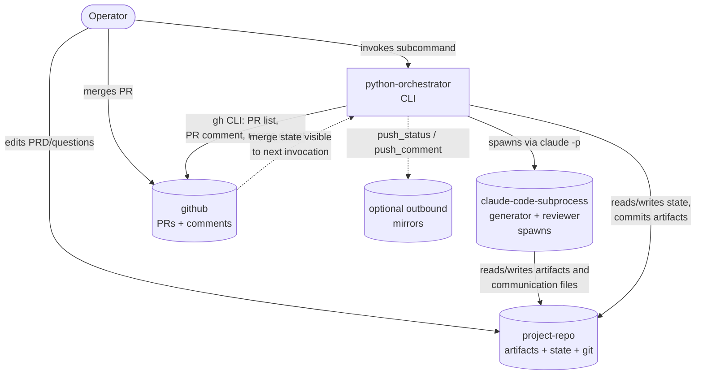

# Python Orchestrator

## Container Summary

The Python Orchestrator is the harness's cross-session runtime — a single Python program invoked as `python -m orchestrator <subcommand>`. It is the only container that initiates Claude Code sessions, transitions artifact state on disk, enforces budgets, snapshots reviewer transcripts, commits artifact trees, and detects merged pull requests. Stack: Python 3 standard library plus thin wrappers around `git` and the GitHub CLI (`gh`). Target: ≤ 800 lines across orchestrator, planner, git layer, state, and mirrors.

## Infrastructure

Runs as an operator-invoked CLI on the operator's local workstation. No daemonization — one subcommand at a time. No long-running services, no scheduler, no message broker.

Key platform dependencies:
- The Python interpreter installed locally.
- The `claude` CLI (Claude Code) installed locally and authenticated against the operator's account; every model interaction goes through `claude -p` as a subprocess. The orchestrator never makes direct Anthropic API calls.
- The `git` and `gh` CLIs installed locally and authenticated; used for branch creation, commits, PR open, PR comment, merge detection.
- The project repo working directory where artifact trees live (boundary described in `@Blueprint(project-repo)`).
- The harness's `config.yaml` (in the kit repo, with optional project-root override) parsed at startup.

Deployment model: distributed as the kit repo (operator clones the kit, points it at the project repo). No build step; pure Python with stdlib-only dependencies for the core driver.

## Entry Points and Boundaries

Work enters the container exclusively through the CLI. One subcommand per invocation, no concurrency between subcommands.

- `python -m orchestrator requirements-loop` — drives the requirements upstream loop. Owned by #LoopDriver composing #SubprocessSpawner, #CommunicationFolderManager, #QuestionsPendingDetector, #StateStore, #GitIntegration, #MetaMaterialiser.
- `python -m orchestrator blueprint-loop` — drives the blueprint upstream loop. Owned by #LoopDriver with the same composition; reviewer set and artifact tree differ per `requirements/features/blueprint-loop.md`.
- `python -m orchestrator work-orders-loop` — drives the work-orders upstream loop. Owned by #LoopDriver; additionally invokes #LocalPlanner-adjacent #BlockedByMaterialiser to populate `.work-order.meta.yaml.blocked_by[]` from each work order's `Depends on.work_orders` block before reviewers run.
- `python -m orchestrator coding-loop [--one]` — drives the per-work-order execution drain. Owned by #CodingLoopDriver composing #LocalPlanner, #SubprocessSpawner (no communication folder), #GitIntegration (PR comment posting + merge detection), #StateStore.
- `python -m orchestrator status` — read-only summary. Owned by #StatusReporter reading #StateStore, #LocalPlanner, and the on-disk `_questions-pending.md` files.

Outbound boundaries: `claude -p` subprocesses (the @Blueprint(claude-code-subprocess) container), the project repo's filesystem and git history (the @Blueprint(project-repo) container), the GitHub API via `gh` (the @Blueprint(github) container), and optional outbound mirrors via #MirrorAdapter.

## System Contracts

### Key Contracts

- **Single-writer for state.** The orchestrator is the only writer of `harness/state/<loop>.json` and `harness/state/<task_id>.json`. Generators write artifact files; the orchestrator commits them.
- **Single-writer for snapshots.** Reviewer review snapshots under `harness/state/reviews/<loop>/[<task-id>/]attempt-<N>/` are written only by the orchestrator at attempt boundaries and on every loop-exit verdict.
- **Never wipes communication folders.** `requirements_communication/`, `blueprints_communication/`, `work-orders_communication/` are mkdir-with-exists-ok before the generator spawns, never rm-rf'd. The folder is the durable cross-invocation conversation transcript.
- **Strictly sequential gen↔reviewer per attempt.** Generator → all reviewers → generator → all reviewers. Reviewers fan out in parallel within an attempt (one `ThreadPoolExecutor` job per reviewer) but no two processes ever write the same communication file concurrently — each reviewer writes only its own dedicated file, the generator runs only when reviewers are quiesced.
- **Verdict parsing is grep-the-trailing-line.** Only the final `VERDICT:` line of each subprocess's captured stdout is parsed for control flow. The body of any review lives in the communication file (upstream loops) or the captured stdout (coding-loop execution); the orchestrator does not parse it.
- **Budget enforcement.** `max_attempts` per invocation (default 25), `max_wall_minutes` per subprocess (default 120), `max_agent_retries` for both rate-limit re-spawns and in-session Stop-hook nudges (default 3). All configurable in `config.yaml`.
- **No auto-merge.** The harness never merges a PR. Merge is operator-driven; the orchestrator only detects post-merge state.
- **Idempotent on re-run.** Re-running the same subcommand without intervening operator changes converges to the same outcome — `pass`, `awaiting_clarification`, or `exhausted` — by reading current on-disk state and the live communication folder.

### Integration Contracts

- **Subcommand exit codes.** `0` for `pass`, `1` for `exhausted`, `2` for `awaiting_clarification`. Distinct so wrapper scripts can react.
- **Subprocess invocation.** `claude -p "<prompt>"`, optionally with `--session-id <uuid>` (attempt 1) or `--resume <uuid>` (attempts 2+) per session-continuity policy, and `--append-system-prompt <skill-body>` on session-1 spawns. Reviewers pass `--disallowedTools Bash,NotebookEdit` for upstream loops or `--disallowedTools Write,Edit,NotebookEdit,Bash` for coding-loop execution; in both cases a `PreToolUse` path-guard hook is configured for upstream-loop reviewer subprocesses.
- **Generator verdict trailer.** Single trailing line `VERDICT: ready_for_review` or `VERDICT: awaiting_clarification` (with `open_questions: N` and `questions_file: <path>` lines for the latter). For the coding-loop per-work-order generator, the trailer additionally carries each gate result.
- **Reviewer verdict trailer.** Single trailing line `VERDICT: pass` or `VERDICT: fail`.
- **Commit messages.** `<loop-name>: attempt <N> passed` on full pass; `<loop-name>: attempt <N> — awaiting_clarification` on the awaiting exit.
- **Per-loop state schema.** JSON files at `harness/state/<loop>.json` (per-loop) and `harness/state/<task_id>.json` (per-WO) following the shape pinned in @Blueprint(state-store).
- **Mirror push protocol.** Outbound-only; `push_status(work_order)` and `push_comment(work_order, body)` calls per @Blueprint(mirror-adapter). Mirror failures are logged and never block orchestrator progress.
- **PR comment posting.** On per-WO all-pass during coding-loop execution, the orchestrator posts the final pass-summary as a PR comment via `gh pr comment`. PR creation is owned by the `coding-generator` (`open-task-pr` skill) inside its subprocess; the orchestrator only reads PR state via `gh pr list --head task/<task_id>`.

### Integration Boundaries

- **Orchestrator vs Claude Code subprocesses.** Each `claude -p` invocation runs in its own process. The orchestrator owns: spawn arguments, captured stdout/stderr, exit-code interpretation, `VERDICT:` parsing. The subprocess owns: filesystem reads/edits, communication-folder writes, model calls, hook reactions. There is no IPC back-channel — stdout, on-disk effects, and the `VERDICT:` trailer are the entire protocol.
- **Orchestrator vs project-repo state.** The orchestrator commits artifact-tree changes (`requirements/`, `blueprints/`, `work-orders/`, `harness/`) but does not author them inside artifact trees that generators own. For per-work-order execution, the generator commits and pushes itself — the orchestrator only inspects post-exit state.
- **Orchestrator vs GitHub.** All GitHub interactions go through `gh` CLI. No direct REST/GraphQL calls. Failures from `gh` (network, rate limit, 4xx) surface as non-zero exit codes; the orchestrator logs and continues for non-critical operations (mirror push, PR comment) and aborts the loop for critical ones (PR creation prerequisites are owned by the per-WO generator, not the orchestrator).
- **Orchestrator vs operator.** The operator's only inputs to the orchestrator are: invoking a subcommand, editing `_questions-pending.md` files, editing `PRD.md`, merging PRs. The orchestrator's only outputs to the operator are: stdout summaries, commits to git, PR comments, and the JSON state files under `harness/state/`.

## Architecture Decision Records

### ADR-001: Python with stdlib-only dependencies for the core driver

**Context.** The orchestrator needs subprocess management, JSON state, file IO, and shell-out to `git`/`gh`/`claude`. The harness ships as a kit operators clone into a project; heavyweight dependencies (a process manager, a workflow framework, an event bus) would add deploy friction without paying back. The line-budget target is ≤ 800 lines.

**Decision.** Python 3 with stdlib-only for the loop driver, planner, git layer, state, and mirrors. `subprocess` for spawning, `concurrent.futures.ThreadPoolExecutor` for the parallel reviewer fan-out, `json` for state, `pathlib` for filesystem. Optional dependencies (e.g. `PyYAML` for meta files) only where stdlib is genuinely awkward.

**Consequences.** Cloning the kit and running a subcommand requires only Python 3 plus the existing `claude`/`git`/`gh` toolchain. Tests run without virtualenv setup. Trade-off: no batteries-included retry/scheduling library — we hand-roll the doubling backoff and the attempt loop. That is fine because the orchestrator's logic is simple enough to fit in a few hundred lines and easy enough to test directly.

### ADR-002: One subcommand at a time, no daemonization

**Context.** The orchestrator could conceivably run as a long-lived daemon polling for state changes (queue ready, PR merged, questions resolved). That would smooth the operator's experience but commit them to keeping a process alive and managing its lifecycle.

**Decision.** Loops are not daemons. The operator runs `python -m orchestrator <subcommand>` once; the subcommand drains as much as it can, then exits. Merge detection happens at the start of the next coding-loop invocation, not in the background.

**Consequences.** The operator decides cadence by invoking subcommands. State files plus git history are the only between-invocation memory; nothing in RAM survives. Crashes are cheap — re-running the subcommand re-derives current state. Trade-off: the operator must initiate every transition. That is consistent with the rest of the design (operator answers `_questions-pending.md`, operator merges PRs).

### ADR-003: One driver, four loop specialisations

**Context.** The four loops (requirements, blueprint, work-orders, coding) share ~80% of their plumbing — spawn generator, spawn reviewers, parse verdicts, retry, commit on pass — and differ in which generator skill runs, which reviewer set evaluates, and which artifact tree is the target. Re-implementing the loop for each subcommand would triplicate the bug surface; over-abstracting would entangle the upstream-loop and coding-loop differences (communication folder vs PR; full reviewer fan-out vs gates declaration).

**Decision.** A shared `loop_driver.py` implements the upstream-loop pattern (gen → reviewer fan-out → retry → commit) consumed by the three upstream loop subcommands. The coding loop has its own driver because it differs structurally (per-work-order drain, gate-declaration-based reviewer set, generator-owned PR open). Per-loop specialisations supply: prompt builders, reviewer list, artifact trees to read/commit, communication folder path, and any post-hooks.

**Consequences.** A spec change to upstream-loop mechanics edits one file. The coding loop stays separate but visibly shares the spawn/parse primitives via shared helpers. Trade-off: a future fifth upstream loop is cheap to add; converging the coding loop into the same driver later would require pulling out the gate-declaration logic into a polymorphism the driver consumes.

### ADR-004: Communication folder is the durable channel; orchestrator does not assemble retry-context blocks

**Context.** Earlier designs had the orchestrator inline every prior review and push-back into the next-attempt prompt block, so the generator's prompt grew with each attempt. That coupled the orchestrator to the conversation content and made push-back a second-class citizen (the generator had to encode its disagreement in prose the orchestrator had to faithfully relay).

**Decision.** Each upstream loop has a sibling-of-artifact-tree communication folder (`requirements_communication/`, `blueprints_communication/`, `work-orders_communication/`) holding one append-only markdown file per agent. Generator and the named reviewer both read and write the file; the orchestrator manages folder lifecycle (ensure-exists, snapshot to state archive, never wipe) but never writes inside the files. Retry prompts name only the failing reviewers; the generator reads each reviewer's file directly.

**Consequences.** The orchestrator stays small; the gen↔reviewer conversation is durably captured in operator-readable markdown; push-back is a write to a specific reviewer's file; the live folder is preserved across loop-exit verdicts so future invocations build on prior context. Trade-off: skills carry the responsibility of finding and reading the right files. Mitigated by including the folder path in the spawn prompt and by the skill prompts spelling out the read/write protocol.
