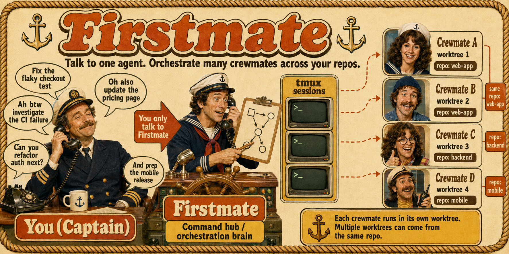

<h1 align="center">firstmate</h1>
<p align="center">
  <a
    href="https://img.shields.io/badge/platform-macOS%20%7C%20Linux-blue?style=flat-square"
    ></a>
  <a href="https://x.com/kunchenguid"
    ></a>
  <a href="https://discord.gg/Wsy2NpnZDu"
    ></a>
</p>

<h3 align="center">Talk to one agent. Ship with a crew.</h3>

<p align="center">
  
</p>

## What it is

You can run one coding agent easily.
But the moment you want three project tasks done in parallel - fixes, investigations, plans, audits - you become a tab-juggler: babysitting sessions, copy-pasting context between repos, forgetting which terminal had the failing test.

firstmate flips the model.
You talk to a single agent - the first mate - and it runs the crew for you: spawning autonomous agents in a visible session backend, giving each a clean git worktree, supervising them to completion, and handing you finished PRs, approved local merges, or standalone investigation reports.

firstmate is not a model, not a harness, not a skill, not an MCP server, and not a CLI.
firstmate is an agent distro for running a crew of agents.
An agent distro is a portable directory of instructions, skills, tooling, policies, and state conventions that turns a general-purpose agent into a specialized one.
There is no app to install: the cloned repo is the distro - `AGENTS.md`, bundled firstmate skills, and helper scripts that any terminal coding agent can follow.
Launching a supported harness inside it instantiates your first mate - and makes you the captain.

## Features

- **One liaison** - you talk only to the first mate; it dispatches, supervises, escalates only real decisions, and reports plain outcomes.
- **Two task shapes** - ship tasks deliver authorized changes; scout tasks leave standalone investigation reports when the intake contract warrants separate research.
- **Explicit project modes** - each project ships via `no-mistakes`, `direct-PR`, or `local-only`, with an optional `+yolo` autonomy flag.
- **Event-driven, zero-token supervision** - a bash watcher sleeps on the fleet and wakes the first mate only when something needs you; verified primary harnesses also get a turn-end backstop that blocks or follows up on a blind stop when work is under way and supervision is not live.
- **Strict project boundary** - the first mate is read-only over your projects except for the narrow guarded and captain-approved operations authorized by [hard rule 1](AGENTS.md#1-identity-and-prime-directives), including fleet sync's guarded safe branch pruning; crewmates make every other project change behind the configured merge authority.

Full detail on every feature lives in [docs/architecture.md](docs/architecture.md).

## Quick Start

### Requirements

- Git and the GitHub CLI, authenticated through `gh auth login`.
- The CLI and dependencies for your selected runtime backend; tmux is the reference default.

The first mate detects and offers to install supported missing tools after you approve.
Backend-specific setup is linked in [Documentation](#documentation).

### Recommended harnesses

All three have verified turn-end guard paths when launched with their documented setup.
Pick whichever one matches your subscription and workflow.

### Install and launch

```sh
gh auth login
git clone https://github.com/kunchenguid/firstmate
cd firstmate
```

Then launch one of the co-primary harnesses; AGENTS.md takes over from there:

**Claude Code**

```sh
claude
```

```sh
```

**Pi**

```sh
pi
# or, when the signed wrapper is installed
```

For Pi, approve the project trust prompt once per clone on first launch so the tracked `.pi/extensions/*.ts` files auto-load.
The hidden operational inputs remain ordinary user-role messages with unchanged delivery, ordering, authority, persistence, and exports.
The preference persists for the effective Firstmate home, and toggling it off restores ordinary rendering.

### Talk to it

```sh
> ahoy! look at my github project xyz, then fix the flaky login test and add dark mode

# firstmate checks its toolchain (asking your consent before installing anything),
# clones the project under projects/ and spawns two isolated workers in the active backend.
# Minutes later:

  PR ready for review, captain: https://github.com/you/xyz/pull/42
  (fix flaky login test - risk: low - CI green)

> alright merge it
```

### More backends

## How It Works

```
            you (the captain)
                  │  chat: requests, decisions, "merge it"
                  ▼
 ┌─────────────────────────────────────┐
 │ firstmate            (this repo)    │
 │ reads projects/ + firstmate routes  │
 │ writes guarded backlog/briefs/state │
 └──┬──────────────┬───────────────┬───┘
    │ backend sends / status files │
    ▼              ▼               ▼
 ┌────────┐   ┌────────┐      ┌────────┐
 │crewmate│   │crewmate│      │crewmate│   one autonomous agent each
 └───┬────┘   └───┬────┘      └───┬────┘
     ▼            ▼               ▼
     │
     ├─ ship: project mode ► PR/local merge ► teardown
     │
     └─ scout: report at data/<id>/report.md ► decision inventory ► relay findings ► teardown
```

You chat with the first mate.
It routes each request to a crewmate in its own session endpoint and git worktree, supervises the fleet with a zero-token event-driven watcher, and brings you finished PRs, approved local merges, or investigation reports.

## Built-in skills

Firstmate ships these user-invocable built-in skills.

| Skill              | What it does                                                                                                                                  |
| ------------------ | -------------------------------------------------------------------------------------------------------------------------------------------- |
| `/afk`             | Enter away-mode supervision: the sub-supervisor self-handles routine notifications in bash, escalates captain-relevant events and bounded declared-external-wait rechecks as batched digests, and actively alerts if delivery gets stuck while you step away |
| `/ahoy`            | Recap visible session events since the prior real captain message plus visibly unanswered captain decisions, falling back to Bearings when invoked as the session's first real captain message |
| `/stow`            | Sweep the session for uncaptured durable knowledge, route each finding to its disk home per AGENTS.md, file undone next steps to the backlog, and report what is now safe to reset |

Bearings invocation examples:

- `/bearings` returns the fresh four-section digest in chat only.
- `/bearings include PRs` keeps chat-only mode and opts into live PR enrichment.
- `/bearings file` replaces today's `data/status-report-<YYYY-MM-DD>.md` from scratch and links it from the four-section chat digest.
- `/bearings file include PRs` combines the dated report with live PR enrichment.

Agent-only reference skills live under `.agents/skills/` and are loaded by firstmate at the trigger points named in [`AGENTS.md`](AGENTS.md).

### Two-tier skill layout

Firstmate's skills live in two separate places with different audiences:

- `.agents/skills/` - agent-loaded skills (this section's table, plus firstmate's agent-only reference skills). Every one of these assumes a live firstmate home and is meaningless, or actively misleading, installed anywhere else, so each carries `metadata.internal: true` in its frontmatter. That flag hides them from installer discovery (tools like the [skills.sh](https://skills.sh) `npx skills add` installer) without affecting how firstmate itself loads them - frontmatter metadata is inert to the agent's own skill loader.
- `skills/` - public, installer-facing skills meant to be installed standalone into any project, independent of firstmate.
  Each one is a self-contained skill with no dependency on firstmate's paths, tools, or vocabulary.
  Today that is `skills/stow`, a generic session-knowledge-sweep skill that routes findings by explicit instruction first, then existing local conventions, then a private `.stow-notes.md` fallback in the current directory, and closes with a resume pointer for the next session.
  It intentionally shares no code with the firstmate-internal `.agents/skills/stow` it is named after, so the two can evolve independently.

## Documentation

- [docs/configuration.md](docs/configuration.md) - environment variables, `FM_HOME`, runtime backend selection, and the files you set.
- [docs/wedge-alarm.md](docs/wedge-alarm.md) - configure the active alert for an away-mode escalation delivery that gets stuck.
- [docs/tmux-backend.md](docs/tmux-backend.md) - current setup and limits for the tmux reference backend.
- [docs/verification/runtime-backends.md](docs/verification/runtime-backends.md) - active maintainer verification for runtime backend guarantees.
- [docs/gitlab-merge-watch.md](docs/gitlab-merge-watch.md) - maintainer verification for GitLab merge watching on arbitrary instances.
- [docs/turnend-guard.md](docs/turnend-guard.md) - the primary session's current "no turn ends blind" backstop, scope, loop safety, and compatibility limits.
- [docs/verification/supervision.md](docs/verification/supervision.md) - active maintainer verification for session-start, guard, continuity, and wedge integrations.
- [docs/scripts.md](docs/scripts.md) - the `bin/` toolbelt reference.
- [docs/documentation-audiences.md](docs/documentation-audiences.md) - documentation audiences and the machine-checked placement boundary.
- [`AGENTS.md`](AGENTS.md) - the distro's always-loaded operating contract and routing index for conditional procedures.
- [CONTRIBUTING.md](CONTRIBUTING.md) - how to contribute, including the dev/test commands.

## Contributing

Contributions are welcome - see [CONTRIBUTING.md](CONTRIBUTING.md) for the workflow, repo conventions, and how to run the tests.

## License

MIT - see [LICENSE](LICENSE).
